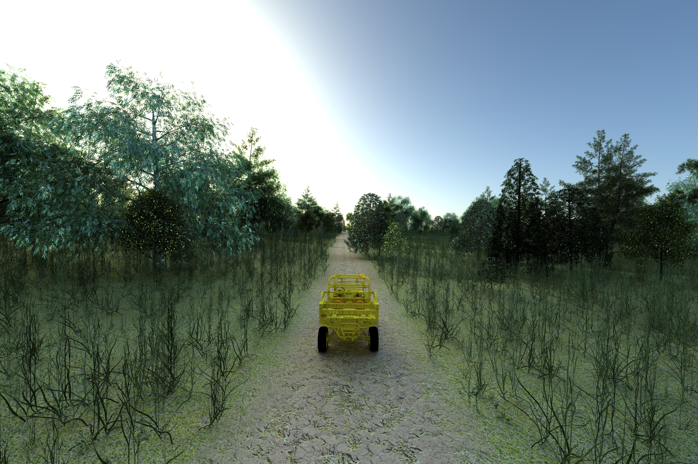
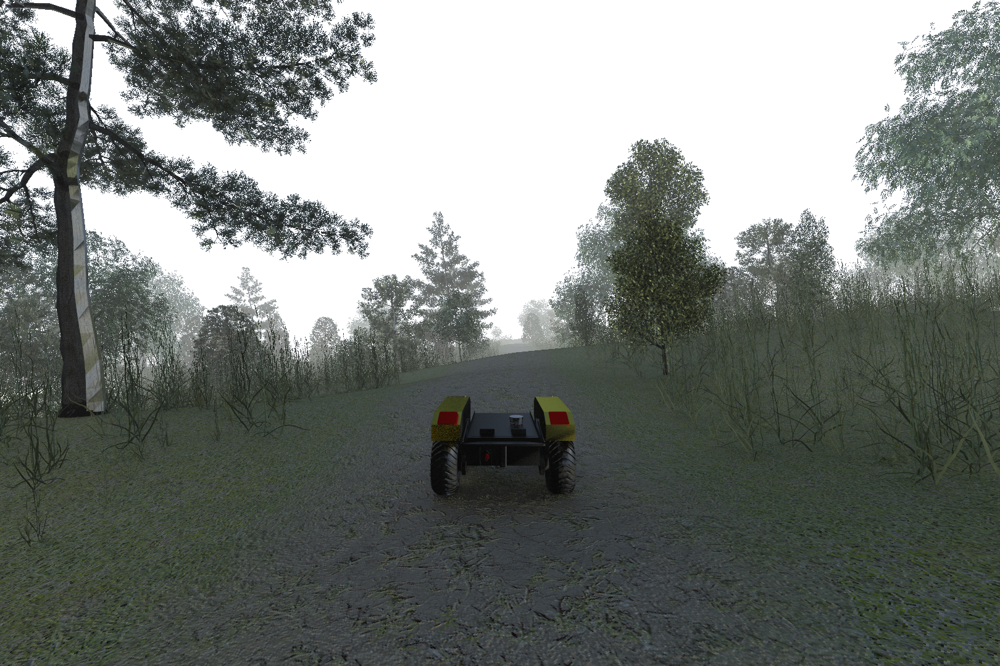
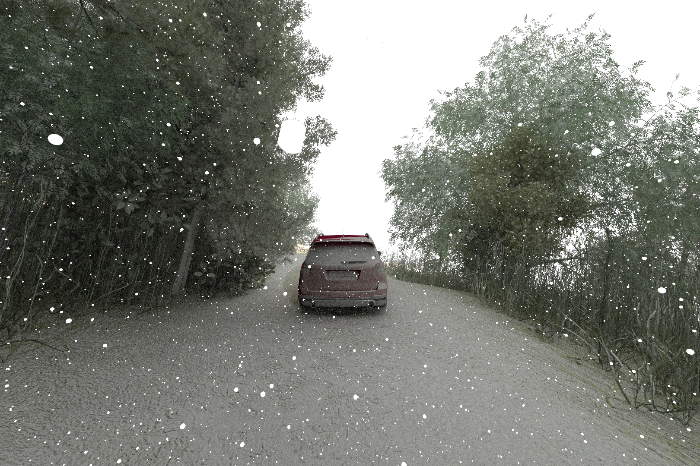

# The MSU Autonomous Vehicle Simulator

Developed at Mississippi State University (MSU), the MSU Autonomous Vehicle Simulator (MAVS) is

* A software library for simulating autonomous vehicles in realistic digital terrain.
* A real-time simulator for evaluating the performance of autonomous perception and navigation software.
* A physics-based sensor simulator for LIDAR, GPS, cameras, and other sensors.

While MAVS is a fully functional standalone simulator, additional wrappers allow MAVS to be integrated with robotic development tools such the Robotic Operating System (ROS). 

This documentation outlines building MAVS, running some example simulations, and interfacing with other software like ROS. 

## License
MAVS is licensed under the [MIT License](https://github.com/CGoodin/msu-autonomous-vehicle-simulator?tab=MIT-1-ov-file#readme).

## Citing MAVS
If you use MAVS for your research, please cite one or more of the following publications.
* [Hudson, C., Goodin, C., Miller, Z., Wheeler, W., & Carruth, D. (2020, August). Mississippi state university autonomous vehicle simulation library. In Proceedings of the Ground Vehicle Systems Engineering and Technology Symposium (pp. 11-13).](http://gvsets.ndia-mich.org/documents/MS2/2020/MS2_1130_Mississippi%20State%20University%20Autonomous%20Vehicle%20Simulation%20Library_Paper.pdf)
* [Goodin, C., Carruth, D. W., Dabbiru, L., Hudson, C. H., Cagle, L. D., Scherrer, N., ... & Jayakumar, P. (2022, June). Simulation-based testing of autonomous ground vehicles. In Autonomous Systems: Sensors, Processing and Security for Ground, Air, Sea and Space Vehicles and Infrastructure 2022 (Vol. 12115, pp. 167-174). SPIE.](https://www.spiedigitallibrary.org/conference-proceedings-of-spie/12115/0000/Simulation-based-testing-of-autonomous-ground-vehicles/10.1117/12.2620502.short)
* [Carruth, D. W., Goodin, C., Dabbiru, L., Scherrer, N., Moore, M. N., Hudson, C. H., ... & Jayakumar, P. (2024). Comparing real and simulated performance for an off?road autonomous ground vehicle in obstacle avoidance. Journal of Field Robotics, 41(3), 798-810.](https://onlinelibrary.wiley.com/doi/pdf/10.1002/rob.22289?casa_token=AWIaWOHouPUAAAAA%3AxC5wIiRRir4cZYoIzuuhiIBSQEuYNSNfMR49nujwvTMz7Ggq1PuCO-W15-w7r8Zq6iIixz4RjR8VVk4)

## MAVS Architecture 
The MAVS is a software library that can be incorporated into a variety of applications through its applicaton programming interface (API). Please see the [API documentation](https://cgoodin.gitlab.io/msu-autonomous-vehicle-simulator/) for information on developing applications with MAVS.

## Building Mavs
See instructions [for building MAVS](docs/MavsBuildInstructions.md).

## Running the Mavs Gui
On Linux systems with Python3 installed, MAVS simulations can be run with a [TKinter-based GUI](docs/Gui/RunningMavsGUI). The MAVS GUI can be used to set up and run sensor simulations in [randomized scenes](docs/Gui/GeneratingRandomDataWithGUI.md).

## Using the MAVS C++ API
Portions of the MAVS API can be accessed in [MATLAB](docs/Interfaces/MavsMatlab) or [Python](docs/Interfaces/MavsPython.md) through the C interfaces.

## MAVS-ROS Package
The mavs_ros package has example [ROS-nodes](docs/Interfaces/MavsROS.md) built around MAVS simulation capabilities. 

## Running simulations from the command line
Several MAVS executables can be run [from the commmand line.](docs/RunningASimulation.md)

## MAVS Input Files
MAVS primarily uses [json input files](docs/MavsSimulationInputsFiles.md). 

## MAVS Sensor Models
MAVS features several different types of sensors including [cameras](docs/Sensors/MavsCamera.md), [LIDAR](docs/Sensors/MavsLidar.md), GPS, [RADAR](docs/Sensors/MavsRadar.md) and [IMUs](docs/Sensors/MavsImu.md).

MAVS can also be used to render [photorealistic images](docs/Sensors/MavsPathTracer.md).

## MAVS Vehicle Models
MAVS has a built-in [vehicle simulator](docs/Vehicles/MavsVehicles.md) and can also be linked to the [Chrono vehicle dynamics](docs/MavsBuildInstructions.md)

## Examples and Utilities
MAVS comes with several [example codes](docs/Examples/MavsExamples.md) and [utilitys](docs/Utilities/MavsUtils.md) that demonstrate how to implement various features through the API.

## Features
MAVS can automatically generate random ecosystems complete with trails and realistic vegetation.

MAVS can also simulate environmental features like rain and dust and their influence on sensors.

