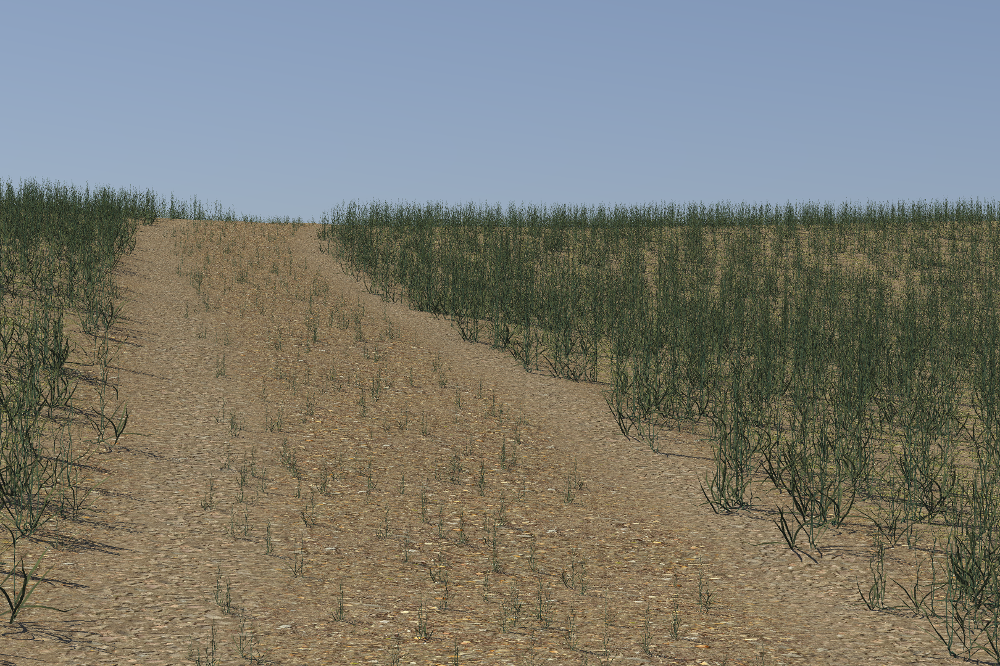

# The MSU Autonomous Vehicle Simulator

Developed at Mississippi State University (MSU), the MSU Autonomous Vehicle Simulator (MAVS) is

* A software library for simulating autonomous vehicles in realistic digital terrain.
* A real-time simulator for evaluating the performance of autonomous perception and navigation software.
* A physics-based sensor simulator for LIDAR, GPS, cameras, and other sensors.

While MAVS is a fully functional standalone simulator, additional wrappers allow MAVS to be integrated with robotic development tools such the [Robotic Operating System (ROS)](https://github.com/CGoodin/mavs_ros) and [ROS-2](https://github.com/CGoodin/mavs-ros2). 

Full MAVS user documentation is available [here](https://mississippi-state-university-otm.github.io/MAVS/).

## License
MAVS is licensed under the [MIT License](https://github.com/Mississippi-State-University-OTM/MAVS?tab=MIT-1-ov-file#readme).

## Citing MAVS
If you use MAVS for your research, please cite one or more of the following publications.
* [Hudson, C., Goodin, C., Miller, Z., Wheeler, W., & Carruth, D. (2020, August). Mississippi state university autonomous vehicle simulation library. In Proceedings of the Ground Vehicle Systems Engineering and Technology Symposium (pp. 11-13).](http://gvsets.ndia-mich.org/documents/MS2/2020/MS2_1130_Mississippi%20State%20University%20Autonomous%20Vehicle%20Simulation%20Library_Paper.pdf)
* [Goodin, C., Carruth, D. W., Dabbiru, L., Hudson, C. H., Cagle, L. D., Scherrer, N., ... & Jayakumar, P. (2022, June). Simulation-based testing of autonomous ground vehicles. In Autonomous Systems: Sensors, Processing and Security for Ground, Air, Sea and Space Vehicles and Infrastructure 2022 (Vol. 12115, pp. 167-174). SPIE.](https://www.spiedigitallibrary.org/conference-proceedings-of-spie/12115/0000/Simulation-based-testing-of-autonomous-ground-vehicles/10.1117/12.2620502.short)
* [Carruth, D. W., Goodin, C., Dabbiru, L., Scherrer, N., Moore, M. N., Hudson, C. H., ... & Jayakumar, P. (2024). Comparing real and simulated performance for an off?road autonomous ground vehicle in obstacle avoidance. Journal of Field Robotics, 41(3), 798-810.](https://onlinelibrary.wiley.com/doi/pdf/10.1002/rob.22289?casa_token=AWIaWOHouPUAAAAA%3AxC5wIiRRir4cZYoIzuuhiIBSQEuYNSNfMR49nujwvTMz7Ggq1PuCO-W15-w7r8Zq6iIixz4RjR8VVk4)

## MAVS Architecture 
The MAVS is a software library that can be incorporated into a variety of applications through its applicaton programming interface (API). Please see the [API documentation](https://cgoodin.gitlab.io/msu-autonomous-vehicle-simulator/) for information on developing applications with MAVS.

## Building Mavs
See instructions [for building MAVS](https://mississippi-state-university-otm.github.io/MAVS/docs/MavsBuildInstructions.html).

## Running the Mavs Gui
On Linux systems with Python3 installed, MAVS simulations can be run with a [TKinter-based GUI](https://mississippi-state-university-otm.github.io/MAVS/docs/Gui/RunningMavsGUI). The MAVS GUI can be used to set up and run sensor simulations in [randomized scenes](https://mississippi-state-university-otm.github.io/MAVS/docs/Gui/GeneratingRandomDataWithGUI.html).

## Using the MAVS C++ API
Portions of the MAVS API can be accessed in [MATLAB](https://www.mathworks.com/matlabcentral/fileexchange/136754-mavs-matlab) or [Python](https://mississippi-state-university-otm.github.io/MAVS/docs/Interfaces/MavsPython.html) through the C interfaces.

## MAVS-ROS Package
The mavs_ros package has example [ROS-nodes](https://mississippi-state-university-otm.github.io/MAVS/docs/Interfaces/MavsROS.html) built around MAVS simulation capabilities. 

## Running simulations from the command line
Several MAVS executables can be run [from the commmand line.](https://mississippi-state-university-otm.github.io/MAVS/docs/RunningASimulation.html)

## MAVS Input Files
MAVS primarily uses [json input files](https://mississippi-state-university-otm.github.io/MAVS/docs/MavsSimulationInputsFiles.html). 

## MAVS Sensor Models
MAVS features several different types of sensors including [cameras](https://mississippi-state-university-otm.github.io/MAVS/docs/Sensors/MavsCamera.html), [LIDAR](https://mississippi-state-university-otm.github.io/MAVS/docs/Sensors/MavsLidar.html), GPS, [RADAR](https://mississippi-state-university-otm.github.io/MAVS/docs/Sensors/MavsRadar.html) and [IMUs](https://mississippi-state-university-otm.github.io/MAVS/docs/Sensors/MavsImu.html).

MAVS can also be used to render [photorealistic images](https://mississippi-state-university-otm.github.io/MAVS/docs/Sensors/MavsPathTracer.html).

## MAVS Vehicle Models
MAVS has a built-in [vehicle simulator](https://mississippi-state-university-otm.github.io/MAVS/docs/Vehicles/MavsVehicles.html) and can also be linked to the [Chrono vehicle dynamics](https://mississippi-state-university-otm.github.io/MAVS/docs/MavsBuildInstructions.html)

## Examples and Utilities
MAVS comes with several [example codes](https://mississippi-state-university-otm.github.io/MAVS/docs/Examples/MavsExamples.html) and [utilities](https://mississippi-state-university-otm.github.io/MAVS/docs/Utilities/MavsUtils.html) that demonstrate how to implement various features through the API.

## Features
MAVS can automatically generate random ecosystems complete with trails and realistic vegetation.

MAVS can also simulate environmental features like rain and dust and their influence on sensors.

