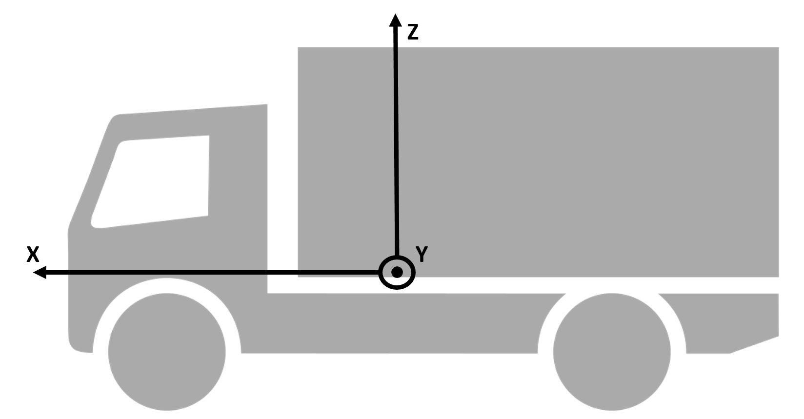

# MAVS Coordinate System
The MAVS coordinate system is local [East-North-Up (ENU)](https://en.wikipedia.org/wiki/Axes_conventions) with East = X, North = Y and Up = Z. The spatial units are in meters.

ENU coordinates are local because they are defined relative to the local origin of the system, as specified by the latitude, longitude, and altitude. In MAVS, the local origin can be specified in the [scene input file](../MavsSceneInputsFiles.md). Latitude and longitude are in decimal degrees, with Northing and Westing being positive and Southing/Easting being negative. Altitude is specified in meters above sea level.

## Vehicle and sensor coordinate systems
MAVS uses the [ISO standard](https://www.iso.org/standard/16332.html) for the vehicle reference frame. In this system, the X-axis of the vehicle faces straight out the front, while the Y-axis faces out the driver side door and the Z-axis out of the roof, as shown in the following figure. The origin should be located in the center of the front axis.

The default coordinate system for sensors is similar, with X facing to the front of the sensor, Y facing to the left, and Z facing up. However, certain sensors have differing coordinate systems specified by the manufacturer. For example, the Velodyne family of sensors as Y facing out and X to the right. In these cases, the manufacturer system is used whenever possible.

## Mesh coordinate system
MAVS meshes should be defined with their origin at the spatial center in the X-Y plane and at the ground level along the Z-axis. The Z-axis should be up, and for oriented objects like houses, the X-axis should face out the front.
