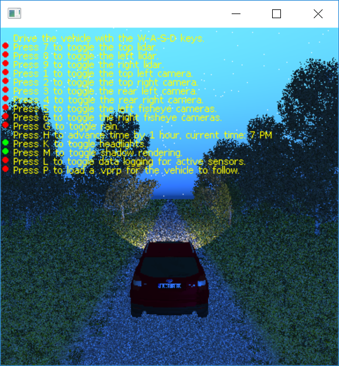

# MAVS Halo Car Example
The MAVS Halo car example is an interactive demonstration of the MAVS sensor, vehicle, and environment simulation that allows the user to save raw and labeled sensor data in a variety of environmental conditions.

The example can be run by typing
``` shell
> ./mavs/build/bin/examples/halo_car_example
```
The user will be prompted to select a MAVS scene file through a file dialog. Alternatively, the user may specify the scene file directly from the command line.
``` shell
> ./mavs/build/bin/examples/halo_car_example ./mavs/data/scenes/range_test_scene.json
```

The scene may take a moment to load, then a control window with the MAVS scene and the Halo vehicle will appear. Instructions for interacting with the simulation through keyboard commands are printed on the screen. Note that the control window must be active (on top) for the keyboard commands to take affect.


## Driving the Vehicle and Turning on Sensors 

The vehicle can be driven through the scene with the W-A-S-D keys, with **W**=throttle, **A**=left, **D**=right, and **S**=brake.

There are 9 sensors on the vehicle, all of which are turned off in the default state. To turn on a sensor, the user must use the keyboard to select the sensor number with the control window active. 

|Number|Sensor|Rate|
|------|------|----|
| 1 | Front Left Camera | 30 Hz |
| 2 | Front Right Camera | 30 Hz |
| 3 | Rear Left Camera | 30 Hz |
| 4 | Rear Right Camera | 30 Hz |
| 5 | Left Fisheye Camera | 30 Hz |
| 6 | Right Fisheye Camera | 30 Hz |
| 7 | Top Lidar (M8) | 10 Hz |
| 8 | Left Bumper Lidar (M8) | 10 Hz |
| 9 | Right Bumper Lidar (M8) | 10 Hz |

When a sensor is on, an additional window showing the current sensor output will be displayed. Additionally, the red indicator next to the sensor in the control window will turn green or blink green. Note that turning on multiple sensors simulataneously may slow down the simulation.

## Controlling Environmental Conditions
Several environmental conditions can be modified by pressing keys in the control window. These include rain, time of day, shadow rendering, and the headlights of the vehicle. Note that for rain, shadows, and headlights, the red indicator will turn green if these features are enabled.

|Key|Function|
|------|------|
| G | Turn rain on/off |
| M | Turn shadow rendering on/off |
| H | Advance time by 1 hour |
| K | Turn the vehicle headlights on/off |

## Logging Sensor Data
Data for active sensors can be logged by pressing **L** when the control window is active. The first time data is logged, the user will be prompted to select an output folder for the data to be written. When data is being logged, the red indicator will be green. Pressing **L** again will turn off data logging. Data logging can be turned on/off by the user at any time, and only currently active sensors will be logged. 

The user can still drive the vehicle while data is logging using the W-A-S-D keys.

## Using a replay file to drive the vehicle
Instead of using the W-A-S-D keys to drive the vehicle, the user can load an ANVEL replay file (.vprp) in text format by pressing the **P** key while the control window is active. A file dialog will prompt the user to select a .vprp file. Once a replay file is selected, the vehicle will automatically follow the path, looping over the path indefinitely. The red indicator will turn green when a .vprp is being followed. If **P** is selected again while the vehicle is following a path, control will be returned to the user.

Note that the user can continue to modify environmental conditions, turn sensors on/off, and record data while the vehicle is following the .vprp path.

## Summary of Keyboard Commands
|Key|Function|
|------|------|
| W | Drive forward |
| S | Brake / Reverse |
| A | Steer left |
| D | Steer right |
| 1 | Toggle Front Left Camera |
| 2 | Toggle Front Right Camera |
| 3 | Toggle Rear Left Camera |
| 4 | Toggle Rear Right Camera |
| 5 | Toggle Left Fisheye Camera |
| 6 | Right Fisheye Camera |
| 7 | Toggle Top Lidar (M8) |
| 8 | Toggle Left Bumper Lidar (M8) |
| 9 | Toggle Right Bumper Lidar (M8) |
| 0 | Toggle Piksi INS |
| G | Increase rain rate |
| T | Increase atmospheric turbidty |
| M | Turn shadow rendering on/off |
| H | Advance time by 15 minutes |
| K | Turn the vehicle headlights on/off |
| R | Render 1080p snapshot with vehicle |
| U | Render 1080p snapshot with no vehicle |
| L | Log data for all active sensors |
| P | Use ANVEL poses to drive vehicle |