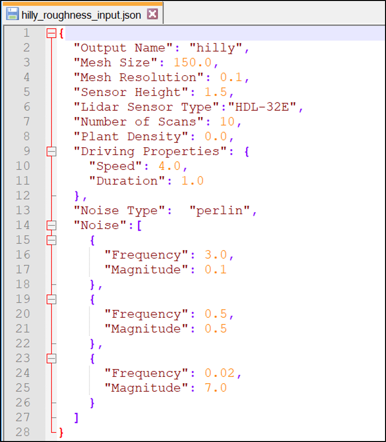
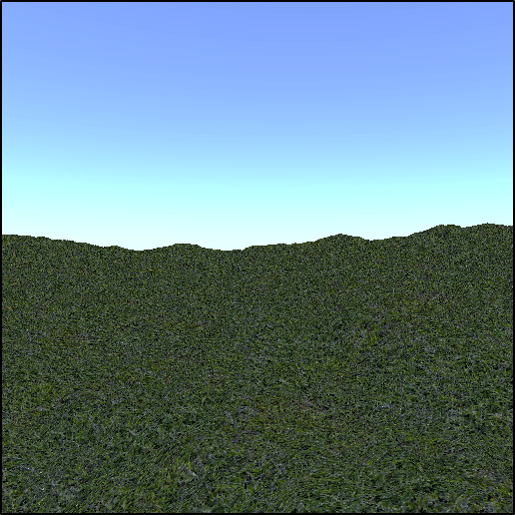
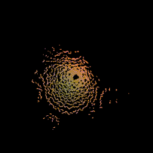

# MAVS Lidar Roughness Analyzer
This code can be used to generate LIDAR output for scans of user-defined rough surfaces. Many instances of rough surfaces will be created and scanned, allowing the user to compile statistics of multiple scans.

The example can be run by typing
``` shell
> ./path_to_mavs_install/build/bin/examples/lidar_roughness_analyzer input_file.json

```

## Inputs
The input file is a json file that contains values for the parameters of the simulation. Examples are in *path_to_mavs_install/data/sims/misc_sims/lidar_roughness*.


* "Output Name": A string that will be used in all the output file names as an identifier
* "Mesh Size": The spatial length of the sides of the terrain, in meters
* "Mesh Resolution": The spatial resolution of the mesh, in meters
* "Sensor Height": The height of the sensor above the ground, in meters
* "Lidar Sensor Type": The type of sensor to simulate. Options are
  * "HDL-32E" - Velodyne HDL-32E
  * "HDL-64E" - Velodyne HDL-64E
  * "VLP-16" - Velodyne Puck
  * "M8" - Quanergy M8
  * "OS1" - Ouster OS1
  * "OS2" - Ouster OS2
* "Number of Scans": The number of unique terrains to generate
* "Plant Density": The desired plant density, in #/m^2. Set to 0.0 to have no plants
* "Driving Properties": You can have the vehicle drive through the scene to create multiple scans per scene. Set "Speed" and "Duration" to 0.0 if driving is not desired
  * "Speed": The desired speed in m/s
  * "Duration": The length (seconds) of the drive. Lidar will generate 10 scans/second.
* "Noise Type": Can be either "perlin" or "gaussian"
* "Noise": Define the roughness parameters of the scene. You can define any number of "decades" of noise. For each decade, you must define the frequency and magnitude of the noise.
  * "Frequency": Spatial frequency of the noise in 1/meters
  * "Magnitude": Magnitude of the noise in meters

Note that there are slight differences in the meaning of the *Frequency* and *Magnitude* parameters when perlin and gaussian noise are used. For gaussian noise, *Magnitude* is taken to be the RMS magnitude of the noise. This means that there may be elevations higher than the value of *Magnitude*, whereas for Perlin noise, the highest elevations will be equal to *Magnitude*. Similarly, for Gaussian noise, *Frequency* is set equal to 1/(ACL) where ACL is the autocorrelation length of the terrain.

## Outputs
For each scan, three output files are saved. The first is a rendering of the scene from the position of the lidar sensor and the second is a top down view of the point cloud (see images below). The last output is a text file (with .pts extension). There are 4 columns in the file corresponding to x-y-z-intensity. The points are registered in world coordinates.


