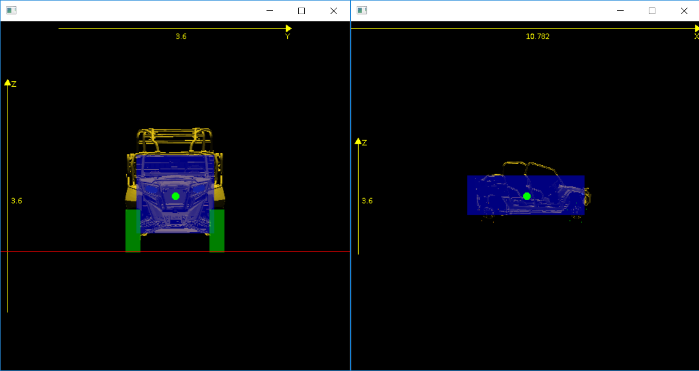

# Creating a New Vehicle File
This tutorial shows how to create a new vehicle file using the MAVS default Reactphysics 3d (RP3D) format, explains the required parameters, and gives some advice for estimating missing data values.

We will use the file "forester_2017_rp3d_tires.json" as a case study. The file can be found in the "data/vehicles/rp3d_vehicles" folder of MAVS. The basic sections of the input file are shown below.
``` json
{
  "Chassis": {...},

  "Powertrain": {...},

  "Axles": [{...},{...}],

  "Mesh": {...},

  "Tire Mesh": {...},

  "Initial Pose": {...}
}
```

The following sections will break down the file block by block and explain the parameters.

## Chassis
For the purposes of the MAVS RP3D model, the chassis encompasses all of the vehicle which is not part of the tires or suspension. 
``` json
"Chassis": {
  "Sprung Mass": 1587.6,
  "CG Offset": 0.15,
  "Dimensions": [ 1.795, 1.45, 1.245 ]
}
```
* "Sprung Mass" - [The portion of the vehicle's total mass that is supported by the suspension, including in most applications approximately half of the weight of the suspension itself](https://en.wikipedia.org/wiki/Sprung_mass). The units are kilograms.
* "CG Offset" - The height of the CG above (or below) the axles of the vehicle. If the CG is below the axle height, this value is negative. Units are meters.
* "Dimensions"  - The length, width, and height of the cuboid representing the vehicle chassis, in meters. The inertial properties of the vehicle are defined by the dimensions of this cuboid and the sprung mass of the vehicle. This cuboid is not used for collision detection.

## Powertrain
The powertrain model in MAVS is fairly simple and is defined by a few parameters. In order to help the user understand the powertrain parameters, the MAVS powertrain model is presented briefly below.

The engine speed is given by 

$$\omega_e = 9.549 v_{long} \rho_{final}/r_{wheel} $$

where $\omega_e$ is the engine speed, $v_{long}$ is the longitudinal velocity of the vehicel in m/s, $\rho_{final}$ is final drive ratio, and $r_{wheel}$ is the deflected radius of the wheel. 

The engine torque is given by 
$$\tau_e = \tau_{max}-\omega_e(\tau_{max}/\omega_{max}) $$

where $\tau_e$ is the engine torque, $\tau_{max}$ is the maximum available engine torque, and $\omega_{max}$ is the maximum engine speed. 

Finally, the wheel torque is given by 
$$ \tau_{wheel} = \alpha\tau_e  \rho_{final} $$
 where $\alpha$ is the throttle setting from 0-1.

With this model as background, the vehicle file powertrain parameters are shown below.
``` json
"Powertrain": {
  "Final Drive Ratio": 1.0,
  "Max Engine Torque": 775.0,
  "Max Engine Rpm": 6000.0,
  "Max Braking Torque": 4263.0,
  "Idle Rpm": 1000.0
}
```
* "Final Drive Ratio" - The final gear ratio of the drivetrain
* "Max Engine Torque" - The maximum engine torque in Newton-meters
* "Max Engine Rpm" - Maximum engine speed in revolutions per minute
* "Max Braking Torque" - The maximum wheel torque applied by the brakes in Newton-meters
* "Idle Rpm" - The minimum engine speed in revolutions per minute.

## Axles
A MAVS RP3D vehicle may have any number of axles. Each axle is independent. The "Axles" entry in the json file is a list with a separate entry for each axle. Each axle entry contains information about the axle position on the vehicle, steering and drivetrain information, the suspension properties, and tire properties. An example entry for a two-axled vehicle is shown below. The parameters for the model are described in the subsections below.
``` json
"Axles": [
  {
    "Longitudinal Offset": 1.25,
    "Track Width": 1.54,
    "Spring Constant": 133300.9,
    "Damping Constant": 14850.85,
    "Spring Length": 0.3,
    "Steered": true,
    "Powered": true,
    "Max Steer Angle": 35.0,
    "Unsprung Mass": 62.45,
    "Tire": {
      "Spring Constant": 156843.0,
      "Damping Constant": 47604.0,
      "Radius": 0.335,
      "Width": 0.3,
      "Section Height": 0.07,
      "High Slip Crossover Angle": 15.0,
      "Viscous Friction Coefficient": 0.05
    }
  },
  {
    "Longitudinal Offset": -1.36,
    "Track Width": 1.54,
    "Spring Constant": 122519.2,
    "Damping Constant": 13649.7,
    "Spring Length": 0.3,
    "Steered": false,
    "Powered": true,
    "Unsprung Mass": 62.45,
    "Tire": {
      "Spring Constant": 156843.0,
      "Damping Constant": 47604.0,
      "Radius": 0.335,
      "Width": 0.3,
      "Section Height": 0.07,
      "High Slip Crossover Angle": 15.0,
      "Viscous Friction Coefficient": 0.05
    }
  }
]
```
### Basic Axle Properties
* "Longitudinal Offset" - Distance (meters) along the longitudinal direction of the vehicle from the vehicle CG. A positive number is forward of the CG, while a negative number is rear of the CG.
* "Track Width" - Distance (meters) between the hub of left and right tires on the axle.
* "Steered" - "true" if the axle is steered, "false" if it is not.
* "Powered" - "true if the axle is powered, "false" if it is unpowered. 
* "Unsprung Mass" - Mass of the suspension in kilograms, including the mass of the tire. 

## Suspension Properties
The suspension is modeled as a [linear spring-damper system](https://en.wikipedia.org/wiki/Mass-spring-damper_model). It is important to note that this is a lumped parameter model that summarizes the properties of the entire suspension. This includes the control arms, bushings, and the actual spring, if one is present. In general, these parameters will not be the same as the suspension spring in isolation.

* "Spring Length" - Length of the spring in meters
* "Damping Constant" - Damping constant in N*s/m
* "Spring Constant" - Spring constant in N/m
 
### Tire Properties
The tire is modeled in MAVS using models for [vehicle terrain interaction](../../Vehicles/mavs_vti.md) and [normal force](../../Vehicles/mavs_radial_tire.md). The reader should refer to the MAVS documentation of these models for more information on the parameters below.
``` json
"Tire": {
  "Spring Constant": 156843.0,
  "Damping Constant": 47604.0,
  "Radius": 0.335,
  "Width": 0.3,
  "Section Height": 0.07,
  "High Slip Crossover Angle": 15.0,
  "Viscous Friction Coefficient": 0.05
}
```

* "Damping Constant" - Damping constant in N*s/m
* "Spring Constant" - Spring constant in N/m
* "Radius" - Undeflected tire radius in meters
* "Width" - Undeflected tire width in meters
* "Section Height" - Section height (distance from rim to outer tread surface of the unloaded tire) in meters.
* "High Slip Crossover Angle" - A parameter of the [MAVS steering model](../../Vehicles/mavs_vti.md), in radians.
* "Viscous Friction Coefficient" - Quantifies the internal resistance of the tire to rotation.

## Mesh and Tire Mesh
The following two blocks define the properties of the rendering assets associated with the vehicle model. Each asset has an associated mesh file that is assumed to be in the "mavs/data/scenes/meshes" folder. You can also define the scale factor and offset of the mesh relative to the vehicle CG. Finally, the rotation values put the meshes in the proper orientation. 

``` json
"Mesh": {
  "File": "vehicles/forester/forester_vehicle_nowheel_rotated.obj",
  "Rotate Y to Z": false,
  "Rotate X to Y": false,
  "Rotate Y to X": false,
  "Offset": [ 0.0, 0.0, -0.1 ],
  "Scale": [ 1.0, 1.0, 1.0 ]
}
```
``` json
"Tire Mesh": {
  "File": "vehicles/forester/forester_single_wheel.obj",
  "Rotate Y to Z": true,
  "Rotate X to Y": false,
  "Rotate Y to X": false,
  "Offset": [ 0.0, 0.0, 0.0 ],
  "Scale": [ 1.0, 1.0, 1.0 ]
}
```

## Initial Pose
The "Initial Pose" block is not used in most MAVS applications. However, the "Initial Pose" is defined by a location in local ENU coordinates (meters) and a normalized quaternion in the [w, x, y, z] format.
``` json
"Initial Pose": {
  "Position": [ 0.0, 0.0, 0.0 ],
  "Orientation": [ 1.0, 0.0, 0.0, 0.0 ]
}
```

## Debug View of the Vehicle Model
The size and alignment of the chassis and tire physics objects with the 3D meshes can be checked with the "rp3d_vehicle_viewer" tool. When [building MAVS from source](../../MavsBuildInstructions.md), the tool will be installed in "$CMAKE_INSTALL_PREFIX/bin/utilities" and can be run with 
``` shell
$./rp3d_vehicle_viewer /path/to/mavs/vehicle.json
```
An example result is shown in the figure below. The blue block is the chassis, while the green cylinders are the tire physics objects.


## Estimating Tire and Suspension Parameters
When developing a new vehicle model, you may frequently encounter the situation where you have access to the vehicle size and weight information from available spec sheets, but you do not know the suspension spring and damping information. In this case, it is useful to estimate these values using a "rule-of-thumb". 

The natural frequency $f_n$ for a spring damper system is the frequency at which the system tends to oscillate in the absence of any driving or damping forces. Vehicle designers have found that most vehicles work best when $f_n\approx 1$. 

Additionally, the motion ratio ($\rho_m$) is the ratio of wheel deflection to spring deflection in a suspension system. While $\rho_m$ may have a wide range of values for different vehicles, a reasonable estimate for most vehicles is $\rho_m=0.35$. 

If the mass load on a given suspension element in the resting state is $m_e$, then a good estimate for the spring stiffness, $k_s$ of the lumped parameter model is 

$$k_s = m_e\Bigg(\frac{2\pi f_n}{\rho_m}\Bigg)^2 $$

A rough estimate for $m_e$ is one-fourth of the vehicle sprung mass. A better estimate can be made by calculating the mass distribution on each axle. For a two axled vehicle, the mass distribution of the front axle, $m_f$ is

$$ m_f =\frac{m_s}{2}\Bigg(\frac{l_r}{l_f+l_r}\Bigg)  $$

where $l_f$ is the distance from the front axle to the CG and $l_r$ is the distance from the CG to the rear axle (both positive). Similarly, the mass on the rear axle, $m_r$ can be calculated

$$ m_r =\frac{m_s}{2}\Bigg(\frac{l_f}{l_f+l_r}\Bigg)  $$

These values can be divided by two (split between left and right) to calculate the spring stiffness for the front and rear suspension elements.

Given a mass $m$ and spring stiffness $k$, the damping coefficient, $c$ can just be estimated as providing critical damping

$$ c=2\sqrt{km} $$
