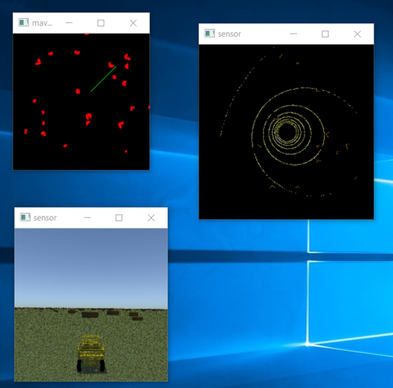

# Simulations with MAVS Autonomy Algorithms 

This example will show how to run a simulation with the MAVS-Python library and use [MAVS built-in autonomy algorithms](../../Autonomy/mavs_autonomy.md) to enable self-driving on the vehicle.

The code for this example can be found in mavs source directory in "src/mavs_python/examples/autonomy/mavs_autonomy_sim_example.py". 

Note that to run this example, you will need to install [numpy](https://numpy.org/).

## The code
Copy "src/mavs_python/examples/autonomy/mavs_autonomy_sim_example.py" to
a directory outside of your source tree and rename it to "my_autonomy_example.py".
```python
import sys
from math import sqrt
import time
from noise import pnoise2
# Set the path to the mavs python api, mavs.py
sys.path.append(r'C:\Users\cgoodin\Desktop\vm_shared\shared_repos\mavs\src\mavs_python')
# Load the mavs python modules
import mavs_interface as mavs
import mavs_python_paths
# Set the path to the mavs data folder
mavs_data_path = mavs_python_paths.mavs_data_path
# Import the additional autonomy modules
import perception
import astar
import potential_field
import rrt
import rrt_star

# Set some simulation properties
# Set to True to show output on screen
display_debug = True
# Goal coordinate in local ENU
goal_point = [50.0, 50.0]
# start coordinate in locan ENU
start_point = [0.0, 0.0]

# Select a scene to load
mavs_scenefile = "/scenes/cube_scene.json"
# Create a MAVS environment and add the scene to it
env = mavs.MavsEnvironment()
env.LoadScene(mavs_data_path+mavs_scenefile)
env.SetTime(13) # 0-23

# Create a MAVS lidar and set the offset
lidar = mavs.MavsLidar('VLP-16')
lidar.SetOffset([0.0, 0.0, 2.0],[1.0,0.0,0.0,0.0])

# Create a window for viewing the vehicle
drive_cam = mavs.MavsCamera()
drive_cam.Model('MachineVision')
# offset of camera from vehicle CG
drive_cam.SetOffset([-10.0,0.0,3.0],[1.0,0.0,0.0,0.0])
# Set camera compression and gain
drive_cam.SetGammaAndGain(0.5,2.0)
# Turn off shadows for this camera for efficiency purposes
drive_cam.RenderShadows(True)

# Load a MAVS vehicle
veh = mavs.MavsRp3d()
veh_file = 'mrzr4.json' 
veh.Load(mavs_data_path+'/vehicles/rp3d_vehicles/' + veh_file)
# Starting point for the vehicle
veh.SetInitialPosition(start_point[0], start_point[1], 0.0) # in global ENU
# Initial Heading for the vehicle, 0=X, pi/2=Y, pi=-X
veh.SetInitialHeading(0.0) # in radians
veh.Update(env, 0.0, 0.0, 1.0, 0.000001)

# Create a vehicle controller
controller = mavs.MavsVehicleController()
# Tell the controller how fast to drive the vehicle
controller.SetDesiredSpeed(5.0) # m/s 
# The next three lines set controller parameters that steer the vehicle. 
controller.SetSteeringScale(3.0)
controller.SetWheelbase(2.4) # meters
controller.SetMaxSteerAngle(0.44) # radians

# Set the planner type to 'rrt', 'rrt_star', 'astar' or 'potential'
# Read input from the command line
planner_type = 'astar'
if len(sys.argv)>1:
    planner_type = str(sys.argv[1])
# create the planner based on user input
planner = None
if (planner_type=='astar'):
   planner = astar.AstarPlanner()
elif(planner_type=='potential'):
    planner = potential_field.PotentialFieldPlanner()
elif(planner_type=='rrt'):
    planner =rrt.RRT()
elif(planner_type=='rrt_star'):
    planner =rrt_star.RRTStar()
else:
    print('Error: Planner type '+str(planner_type)+' not recognized.')
    exit()

# Create and occupancy grid and resize it
grid = perception.LidarGrid()
# This is the number of cells in each dimension
grid.resize(200,200)
# Set the resolution (in meters) of the grid
grid.info.resolution = 1.0
# Set the origin of the grid (lower left corner)
# upper right corner = lowerleft + dimension*res
grid.set_origin(-100.0,-100.0)
# Set the height threshold for an obstacle
grid.height_thresh = 0.5
# This will inflate the size of obstacles
# default is zero
grid.inflation = 1;

dt = 1.0/100.0 # time step, seconds
n = 0 # loop counter
total_sim_time = 0.0
goal_thresh_dist = 4.0
dist_to_goal = 100.0
while dist_to_goal>goal_thresh_dist and total_sim_time<100.0:
    
    # Update the driving command using the controller
    controller.SetCurrentState(veh.GetPosition()[0],veh.GetPosition()[1],veh.GetSpeed(),veh.GetHeading())
    dc = controller.GetDrivingCommand(dt)

    # Update the vehicle
    veh.Update(env, dc.throttle, dc.steering, dc.braking, dt)

    # Get the current vehicle position and orientation
    position = veh.GetPosition()
    orientation = veh.GetOrientation()

    # Check to see if we've advanced towards our goal
    dist_to_goal = sqrt(pow(position[0]-goal_point[0],2)+pow(position[1]-goal_point[1],2))

    # Update the sensors and recalculate the path at 10 Hz
    if n%10==0 and n>0:
        # The AdvanceTime method updates the other actors
        # Update the animated vehicle position
        # The Ego-Vehicle is always actor 0
        env.SetActorPosition(0,position,orientation)
        env.AdvanceTime(10.0*dt)
        # Update and display the drive camera
        # which is for visualization purposes only.
        if (display_debug):
            drive_cam.SetPose(position,orientation)
            drive_cam.Update(env,10.0*dt)
            drive_cam.Display()    
        # Update and display the lidar
        lidar.SetPose(position,orientation)
        lidar.Update(env,10.0*dt)
        if (display_debug):
            lidar.Display()   
        # Get lidar point cloud registered to world coordinates
        registered_points = lidar.GetPoints()

        # add the points to the grid
        grid.add_registered_points(registered_points)

        # get the path from the planner
        path,path_enu = planner.plan(grid,position[0],position[1],goal_point[0],goal_point[1])

        if path:
            # Update the controller path
            controller.SetDesiredPath(path_enu)
            grid.SetCurrentPath(path)
        else:
            print("WARNING: PATH NOT FOUND" )
        # Display the current occupancy grid
        if (display_debug):
            grid.display()
    
    # Update the loop counter
    n = n + 1
    total_sim_time = total_sim_time + dt
```

## The explanation

In this section we'll break down the code piece by piece.

The first few lines load the required python modules.
Note that in your code you will need to edit line 4 to be the full path to the directory of your mavs installation. Because we'll be loading an existing MAVS scene and vehicle file, it helps to also define the *mavs_data_path variable*. The autonomy algorithms (perception, astar, potential_field, rrt, and rrt_star) will also be imported. You can either copy these to your local directory or [add the *mavs_python/examples/autonomy* directory to your PYTHONPATH](https://stackoverflow.com/questions/3402168/permanently-add-a-directory-to-pythonpath).
```python
import sys
from math import sqrt
import time
from noise import pnoise2
# Set the path to the mavs python api, mavs.py
sys.path.append(r'C:\Users\cgoodin\Desktop\vm_shared\shared_repos\mavs\src\mavs_python')
# Load the mavs python modules
import mavs_interface as mavs
import mavs_python_paths
# Set the path to the mavs data folder
mavs_data_path = mavs_python_paths.mavs_data_path
# Import the additional autonomy modules
import perception
import astar
import potential_field
import rrt
import rrt_star
```

Next, a few high-level simulation variables need to be defined. The "display_debug" variable can turn the visual output on or off. If *display_debug=True*, output from the camera, lidar, and obstacle map will be displayed on the screen. If false, no output will be displayed. The simulation will run faster with *display_debug=False*.
```python
# Set some simulation properties
# Set to True to show output on screen
display_debug = True
# Goal coordinate in local ENU
goal_point = [50.0, 50.0]
# start coordinate in locan ENU
start_point = [0.0, 0.0]
```

Next, a [scene file](../../MavsSceneInputsFiles.md) is loaded and an [environment](../../Environment/MavsEnvironmentParams.md) created.
```python
# Select a scene to load
mavs_scenefile = "/scenes/cube_scene.json"
# Create a MAVS environment and add the scene to it
env = mavs.MavsEnvironment()
env.LoadScene(mavs_data_path+mavs_scenefile)
env.SetTime(13) # 0-23
```

Next we will create the sensors. The first sensor is the primary sensor used for perception in this example, a VLP-16 lidar mounted to the roof of the vehicle.
```python
# Create a MAVS lidar and set the offset
lidar = mavs.MavsLidar('VLP-16')
lidar.SetOffset([0.0, 0.0, 2.0],[1.0,0.0,0.0,0.0])
```
The next sensor is not used by the autonomy but is useful for visualization of the vehicle. The camera is created and mounted behind the vehicle in "follow" mode.
```python
# Create a window for viewing the vehicle
drive_cam = mavs.MavsCamera()
drive_cam.Model('MachineVision')
# offset of camera from vehicle CG
drive_cam.SetOffset([-10.0,0.0,3.0],[1.0,0.0,0.0,0.0])
# Set camera compression and gain
drive_cam.SetGammaAndGain(0.5,2.0)
# Turn on/off shadows for this camera for efficiency purposes
drive_cam.RenderShadows(True)
```

To complete the scenario setup, the vehicle is created and added to the scene. The vehicle is initialized by calling veh.Update with a very small time step.
```python
# Load a MAVS vehicle
veh = mavs.MavsRp3d()
veh_file = 'mrzr4.json' 
veh.Load(mavs_data_path+'/vehicles/rp3d_vehicles/' + veh_file)
# Starting point for the vehicle
veh.SetInitialPosition(start_point[0], start_point[1], 0.0) # in global ENU
# Initial Heading for the vehicle, 0=X, pi/2=Y, pi=-X
veh.SetInitialHeading(0.0) # in radians
veh.Update(env, 0.0, 0.0, 1.0, 0.000001)
```

Now that the simulation is initialized, the components of the autonomy will be added. The first autonomous module to be added is the vehicle controller. The "SetSteeringScale" adjusts the lookahead distance of the controller. Larger values will give smoother steering but may cut corners. The wheelbase is the distance between the front and rear axle in meters. The MaxSteerAngle may be set to something less than the mechanical max to give smoother steering. In this case, we choose 25 degrees = 0.44 radians for the max.
```python
# Create a vehicle controller
controller = mavs.MavsVehicleController()
# Tell the controller how fast to drive the vehicle
controller.SetDesiredSpeed(5.0) # m/s 
# The next three lines set controller parameters that steer the vehicle. 
controller.SetSteeringScale(3.0)
controller.SetWheelbase(2.4) # meters
controller.SetMaxSteerAngle(0.44) # radians
```

Next, the planner type is chosen. This choice will be used in the simulation loop to do the path planning. The planner can be specified from the command line.
```python
# Set the planner type to 'rrt', 'rrt_star', 'astar' or 'potential'
# Read input from the command line
planner_type = 'astar'
if len(sys.argv)>1:
    planner_type = str(sys.argv[1])
# create the planner based on user input
planner = None
if (planner_type=='astar'):
   planner = astar.AstarPlanner()
elif(planner_type=='potential'):
    planner = potential_field.PotentialFieldPlanner()
elif(planner_type=='rrt'):
    planner =rrt.RRT()
elif(planner_type=='rrt_star'):
    planner =rrt_star.RRTStar()
else:
    print('Error: Planner type '+str(planner_type)+' not recognized.')
    exit()
```

The next aspect of the autonomy is the perception. We create a lidar grid to process the points and calculate the location of obstacles. In this case we create a 200x200 meter grid with 1x1 meter cells, a lower-left corner at (-100,-100) and an upper right corner at (100,100). The grid.height_thresh parameter is the minimum in-cell slope that will be considered traversable. The grid.inflation value adds a 1-cell thick layer around each obstacle cell for safety purposes. Setting it to zero will remove the 1-layer padding it, while increasing it will give more padding.
```python
# Create and occupancy grid and resize it
grid = perception.LidarGrid()
# This is the number of cells in each dimension
grid.resize(200,200)
# Set the resolution (in meters) of the grid
grid.info.resolution = 1.0
# Set the origin of the grid (lower left corner)
# upper right corner = lowerleft + dimension*res
grid.set_origin(-100.0,-100.0)
# Set the height threshold for an obstacle
grid.height_thresh = 0.5
# This will inflate the size of obstacles
# default is zero
grid.inflation = 1;
```

Next, we define some important variables for managing the simulation execution. The simulation rate is set to 100 Hz, and the loop counter, which will be used later, is initialized to zero. The total simulation time, which will be used to test for simulation timeout, is also initialized to zero. The *goal_thresh_dist* is the distance from the goal point that the vehicle needs to reach for the simulation to complete. The *dist_go_goal* parameter will be updated during the simulation loop, but for now it is initialized to zero.
```python
dt = 1.0/100.0 # time step, seconds
n = 0 # loop counter
total_sim_time = 0.0
goal_thresh_dist = 4.0
dist_to_goal = 100.0
```

Next we start the simulation loop. The loop will run until the vehicle reaches the goal or 100 seconds of simulated time have elapsed.
```python
while dist_to_goal>goal_thresh_dist and total_sim_time<100.0:
```

Next, the vehicle controller is updated using the current state of the vehicle. It will return driving commands based on the vehicle state and the desired path.
```python
    # Update the driving command using the controller
    controller.SetCurrentState(veh.GetPosition()[0],veh.GetPosition()[1],veh.GetSpeed(),veh.GetHeading())
    dc = controller.GetDrivingCommand(dt)
```
Next, the vehicle is updated using the driving commands from the controller. The position and orientation are extracted for use later. We also recalcuate the distance to the goal to see if we've reached the goal point.
```python
    # Update the vehicle
    veh.Update(env, dc.throttle, dc.steering, dc.braking, dt)

    # Get the current vehicle position and orientation
    position = veh.GetPosition()
    orientation = veh.GetOrientation()

    # Check to see if we've advanced towards our goal
    dist_to_goal = sqrt(pow(position[0]-goal_point[0],2)+pow(position[1]-goal_point[1],2))
```

The simulation is running at 100 Hz. Every 10 steps, or at 10 Hz, we update the sensors and refresh the path calcuated by the autonomy algorithms. The first step is to update the visualization of the vehicle animation and render the debug window if *display_debug=True*.
```python
    # Update the sensors and recalculate the path at 10 Hz
    if n%10==0 and n>0:
        # The AdvanceTime method updates the other actors
        # Update the animated vehicle position
        # The Ego-Vehicle is always actor 0
        env.SetActorPosition(0,position,orientation)
        env.AdvanceTime(10.0*dt)
        # Update and display the drive camera
        # which is for visualization purposes only.
        if (display_debug):
            drive_cam.SetPose(position,orientation)
            drive_cam.Update(env,10.0*dt)
            drive_cam.Display()   
```

Next, we update the lidar and get the measured points as a list.
```python
        # Update and display the lidar
        lidar.SetPose(position,orientation)
        lidar.Update(env,10.0*dt)
        if (display_debug):
            lidar.Display()   
        # Get lidar point cloud registered to world coordinates
        registered_points = lidar.GetPoints()
```

The lidar points are then added to the perception grid so the slope map can be updated.
```python
        # add the points to the grid
        grid.add_registered_points(registered_points)
```

In the next lines, the updated occupancy grid is passed to the path planning algorithm and a new path is generated. A warning is generated if the planner fails to find a path to the goal. The path is output as both a list of grid indexes and horizontal ENU coordinates. If *display_debug=True*, the updated grid is displayed.
```python
        # get the path from the planner
        path,path_enu = planner.plan(grid,position[0],position[1],goal_point[0],goal_point[1])

        if path:
            # Update the controller path
            controller.SetDesiredPath(path_enu)
            grid.SetCurrentPath(path)
        else:
            print("WARNING: PATH NOT FOUND" )
		 # Display the current occupancy grid
        if (display_debug):
            grid.display()
```

At the bottom of the simulation loop, the loop counter and simulation time are updated.
```python
    # Update the loop counter
    n = n + 1
    total_sim_time = total_sim_time + dt
```

### Running the program
To run the program, open a terminal in the directory that contains the script and type:
```bash
$python my_autonomy_example.py astar
```
The command line argument can be *astar*, *potential*, *rrt*, or *rrt_star*. If *display_debug=True*, screen output like the image below will be shown.

