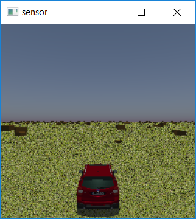

# Using MAVS to Create and Drive a Vehicle

This example will show how to create a vehicle with the python library and drive it with the keyboard.

The code for this example can be found in mavs source directory under "src/mavs_python/examples/driving_example.py". 

## The code
Copy "mavs/src/mavs_python/examples/driving_example.py" to
a directory outside of your source tree and rename it to "my_driving_example.py".

```python
import time
import sys
# Set the path to the mavs python api, mavs.py
sys.path.append(r'C:/path/to/mavs/src/mavs_python')
# Load the mavs python modules
import mavs_interface as mavs
import mavs_python_paths
# Set the path to the mavs data folder
mavs_data_path = mavs_python_paths.mavs_data_path

# Select a scene and load it
mavs_scenefile = "/scenes/cube_scene.json"
scene = mavs.MavsEmbreeScene()
scene.Load(mavs_data_path+mavs_scenefile)

# Create a MAVS environment and add the scene to it
env = mavs.MavsEnvironment()
env.SetScene(scene.scene)

# Set environment properties
env.SetTime(13) # 0-23

#Create and load a MAVS vehicle
veh = mavs.MavsRp3d()
# vehicle files are in the mavs "data/vehicles/rp3d_vehicles" folder
veh_file = 'forester_2017_rp3d.json'
veh.Load(mavs_data_path+'/vehicles/rp3d_vehicles/' + veh_file)
# Starting point for the vehicle
veh.SetInitialPosition(100.0, 0.0, 0.0) # in global ENU
# Initial Heading for the vehicle, 0=X, pi/2=Y, pi=-X
veh.SetInitialHeading(0.0) # in radians
veh.Update(env, 0.0, 0.0, 1.0, 0.000001)

# Create a window for driving the vehicle with the W-A-S-D keys
# window must be highlighted to input driving commands
drive_cam = mavs.MavsCamera()
# nx,ny,dx,dy,focal_len
drive_cam.Initialize(256,256,0.0035,0.0035,0.0035)
# offset of camera from vehicle CG
drive_cam.SetOffset([-10.0,0.0,3.0],[1.0,0.0,0.0,0.0])
# Set camera compression and gain
drive_cam.SetGammaAndGain(0.5,2.0)
# Turn off shadows for this camera if it is slow on your system
drive_cam.RenderShadows(True)

# Now start the simulation main loop
dt = 1.0/30.0 # time step, seconds
n = 0 # loop counter
while (True):
    # tw0 is for timing purposes used later
    tw0 = time.time()

    # Get the driving command
    dc = drive_cam.GetDrivingCommand()

    # Update the vehicle with the driving command
    veh.Update(env, dc.throttle, dc.steering, dc.braking, dt)

    # Get the current vehicle position
    position = veh.GetPosition()
    orientation = veh.GetOrientation()

    # Update the animated vehicle position
    # The Ego-Vehicle is always actor 0
    env.SetActorPosition(0,position,orientation)

    # Update the camera sensors at 10 Hz
    # Each sensor calls three functions
    # "SetPose" aligns the sensor with the current vehicle position,
    # the offset is automatically included.
    # "Update" creates new sensor data, point cloud or image
    # "Display" is optional and opens a real-time display window
    if n%3==0:
        # Update the drive camera at 10 Hz
        drive_cam.SetPose(position,orientation)
        drive_cam.Update(env,dt)
        drive_cam.Display()
    # uncomment the following lines to get some state
    # variables for the vehicle	
    #long_acc = veh.GetLongitudinalAcceleration()
    #lat_acc = veh.GetLateralAcceleration()
    #front_left_normal_force = veh.GetTireNormalForce(0)

    # Update the loop counter
    n = n+1

    # The following lines ensure that the sim
    # doesn't run faster than real time, which 
    # makes it hard to drive
    tw1 = time.time()
    wall_dt = tw1-tw0
    if (wall_dt<dt):
        time.sleep(dt-wall_dt)
```

## The explanation

In this section we'll break down the code piece by piece.

The first few lines load the required python modules.
Note that in your code you will need to edit line 4 to be the full path to the directory of your mavs installation. Because we'll be loading an existing MAVS scene and vehicle file, it helps to also define the *mavs_data_path variable*.
```python
import time
import sys
# Set the path to the mavs python api, mavs.py
sys.path.append(r'C:/path/to/mavs/src/mavs_python')
# Load the mavs python modules
import mavs_interface as mavs
import mavs_python_paths
# Set the path to the mavs data folder
mavs_data_path = mavs_python_paths.mavs_data_path
```

The next few lines create a MAVS scene and environment and add the MAVS scene to the environment. The time of the environment is set to 1 PM. There are many additional options for [setting environment properties](../../Environment/MavsEnvironmentParams.md).
```python
# Select a scene and load it
mavs_scenefile = "/scenes/cube_scene.json"
scene = mavs.MavsEmbreeScene()
scene.Load(mavs_data_path+mavs_scenefile)

# Create a MAVS environment and add the scene to it
env = mavs.MavsEnvironment()
env.SetScene(scene.scene)

# Set environment properties
env.SetTime(13) # 0-23
```

The next lines load an [MAVS vehicle file](../../Vehicles/MavsVehicles.md) and place it in the scene. The call to *vehicle.Update* is made with a small timestep to allow the simulation to load and initialize the vehicle before the simulation loop begins.
```python
#Create and load a MAVS vehicle
veh = mavs.MavsRp3d()
# vehicle files are in the mavs "data/vehicles/rp3d_vehicles" folder
veh_file = 'forester_2017_rp3d.json'
veh.Load(mavs_data_path+'/vehicles/rp3d_vehicles/' + veh_file)
# Starting point for the vehicle
veh.SetInitialPosition(100.0, 0.0, 0.0) # in global ENU
# Initial Heading for the vehicle, 0=X, pi/2=Y, pi=-X
veh.SetInitialHeading(0.0) # in radians
# arguments are environment, throttle, steering, braking, time step
veh.Update(env, 0.0, 0.0, 1.0, 0.000001)
```

Next, a MAVS camera is created. An interactive window will allow you to drive the vehicle with the W-A-S-D keys. The last line can be changed to *drive_cam.RenderShadows(False)* if the simulation runs slowly on your system.
```python
# Create a window for driving the vehicle with the W-A-S-D keys
# window must be highlighted to input driving commands
drive_cam = mavs.MavsCamera()
# parameters are nx,ny,dx,dy,focal_len
drive_cam.Initialize(256,256,0.0035,0.0035,0.0035)
# offset of camera from vehicle CG
drive_cam.SetOffset([-10.0,0.0,3.0],[1.0,0.0,0.0,0.0])
# Set camera compression and gain
drive_cam.SetGammaAndGain(0.5,2.0)
# Turn off shadows for this camera if it is slow on your system
drive_cam.RenderShadows(True)
```

The next few lines initialize some simulation loop tracking variables and start the simulation. The loop will run at 30 Hz. Note that because the while loop is unconditionally true, you will need to use *Ctrl-C* in the terminal to exit the simulation.
```python
# Now start the simulation main loop
dt = 1.0/30.0 # time step, seconds
n = 0 # loop counter
while (True):
```

The next lines update the vehicle at each step of the simulation loop. The driving command is gathered automatically from the camera window created earlier. The position of the vehicle animation in the render window is updated explicitly in the last line.
```python
    # tw0 is for timing purposes used later
    tw0 = time.time()

    # Get the driving command
    dc = drive_cam.GetDrivingCommand()

    # Update the vehicle with the driving command
    veh.Update(env, dc.throttle, dc.steering, dc.braking, dt)

    # Get the current vehicle position
    position = veh.GetPosition()
    orientation = veh.GetOrientation()

    # Update the animated vehicle position
    # The Ego-Vehicle is always actor 0
    env.SetActorPosition(0,position,orientation)
```

In the next lines, the camera is updated.  The overall simulation loop runs at 30 Hz, but in this example the camera runs at 10 Hz. Note that the offset and relative orientation of the camera are automatically calcuated based on the definition with the sensor was created, so only the position and orientation of the vehicle the sensor is attached to need to be updated.
```python
    if n%3==0:
        drive_cam.SetPose(position,orientation)
        drive_cam.Update(env,dt)
        drive_cam.Display()
```

The next few lines are commented out, but show examples about how some state variables of the vehicle can be accessed if desired.
```python
    # uncomment the following lines to get some state
    # variables for the vehicle	
    #long_acc = veh.GetLongitudinalAcceleration()
    #lat_acc = veh.GetLateralAcceleration()
    #front_left_normal_force = veh.GetTireNormalForce(0)
```

Finally, the loop counter, which is used to execute the sensor at 10 Hz in the 30 Hz loop, is updated. Additionally, python timers are used to ensure that the simulation doesn't run faster than real-time, which makes the vehicle difficult to drive.
```python
    # Update the loop counter
    n = n+1

    tw1 = time.time()
    wall_dt = tw1-tw0
    if (wall_dt<dt):
        time.sleep(dt-wall_dt)
```

### Running the program

To run the program, open a terminal in the directory that contains the script and type:
```bash
$python my_driving_example.py
```
If the code is running correctly, a display window like the one below will appear. When the window is active, you can drive the vehicle with the WASD keys. Press *Ctrl-C* in the terminal to stop the simulation.

