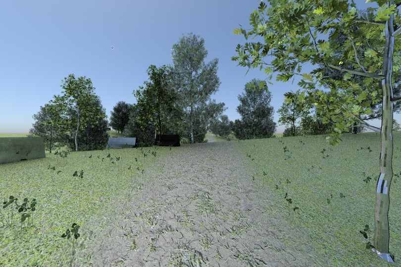
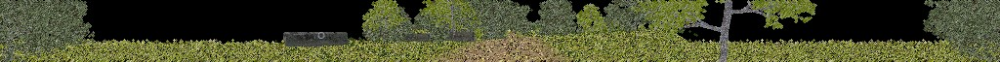
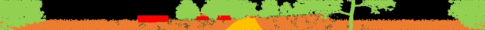

# Using MAVS to Create Labeled Lidar Point Clouds

In this example, we will learn how to use MAVS to create a lidar sensor, create a scene with user defined properties, and save labeled point cloud data from the scene to multiple file formats.

The code for this example can be found in mavs source directory under "src/mavs_python/examples/lidar_trainer_example.py". It will automatically generate a scene that looks like the following image.



Raw and labeled point clouds will be automatically created and saved in the scene.



## The code
Copy "mavs/src/mavs_python/examples/lidar_trainer_example.py" to
a directory outside of your source tree and rename it to "my_lidar_trainer.py".

```python
import random
import sys
# Set the path to the mavs python api, mavs_interface.py
# you will have to change this on your system
sys.path.append(r'C:\path\to\mavs\src\mavs_python')
# Load the mavs python modules
import mavs_interface as mavs

# Create the lidar and set the offset
lidar = mavs.MavsLidar('OS1')
lidar.SetOffset([0.0, 0.0, 1.830],[1.0,0.0,0.0,0.0])

# create a randomized mavs scene
random_scene = mavs.MavsRandomScene()
random_scene.terrain_width = 100.0
random_scene.terrain_length = 100.0
random_scene.lo_mag = float(random.randrange(0,120))/10.0
random_scene.hi_mag = 0.0
random_scene.plant_density = float(random.randrange(25,50))/100.0
random_scene.trail_width = 2.0
random_scene.track_width = 0.3
random_scene.wheelbase = 1.8
scene_name = 'mavs_scene'
random_scene.basename = scene_name
random_scene.eco_file = 'american_southeast_forest_obstacles.json'
random_scene.path_type = 'Ridges'
random_scene.CreateScene()
random_scene.TurnOnLabeling()

#--- Load the waypoints that go with this scene ----#
waypoints = mavs.MavsWaypoints()
waypoints.Load('./'+random_scene.basename+'_path.vprp')
# Get the scene geometry and put the waypoints on the ground
scene = mavs.MavsEmbreeScene()
scene.Load(scene_name+'_scene.json')
waypoints.PutWaypointsOnGround(scene)

# Create a MAVS environment and add the scene to it
env = mavs.MavsEnvironment()
env.SetScene(random_scene.scene)

# loop over all the poses in the waypoints list
for i in range(waypoints.num_waypoints):
	current_position = waypoints.GetWaypoint(i)
	current_orient = waypoints.GetOrientation(i)
	#Set pose of the lidar and scan a frame, saving labeledpoints
	lidar.SetPose(current_position,current_orient)
	lidar.Update(env,0.1)
	# Annotate the frame
	lidar.AnnotateFrame(env)
	# Save the annotated frame and display it
	lidar.AnalyzeCloud('labeled_lidar',i,False)
	lidar.SetDisplayColorType('label')
	lidar.SaveLabeledPcd('labeled_lidar'+str(i).zfill(4)+'.pcd')
	lidar.DisplayPerspective()
	lidar.SaveProjectedLidarImage('labeled_lidar'+str(i).zfill(4)+'.bmp')
```

## The explanation

In this section we'll break down the code piece by piece.

The first few lines load the required python modules.
Note that in your code you will need to edit line 5 to be the full path to the directory of your mavs installation
```python
import random
import sys
# Set the path to the mavs python api, mavs_interface.py
# you will have to change this on your system
sys.path.append(r'C:\path\to\mavs\src\mavs_python')
# Load the mavs python modules
import mavs_interface as mavs
```

The next few lines create a MAVS lidar sensor and set the offset of the sensor relative to the input pose.

The offset is in [x,y,z] meters relative to the input pose, and the relative
orientaiton is a quaterion rotation from the default pose.
In this case, the offset will be 1.83 meters above the ground.
The orientation will be aligned with the pose.
The 'OS1' in the lidar constructor specifies the type of lidar sensor.
The options are 'HDL-32E', 'HDL-64E', 'M8','OS1', 'OS2',
'LMS-291', 'VLP-16', and 'RS32'.
```python
# Create the lidar and set the offset
lidar = mavs.MavsLidar('OS1')
lidar.SetOffset([0.0, 0.0, 1.830],[1.0,0.0,0.0,0.0])
```

In the next section, we define the properties of a mavs scene and create it.
The call to "random_scene.TurnOnLabeling()" is required because we plan to generate annotated data. See the
[API definition for the MavsRandomScene](https://cgoodin.gitlab.io/msu-autonomous-vehicle-simulator/classmavs__python_1_1mavs__interface_1_1_mavs_random_scene.html)
for more details about each variable.
```python
# create a randomized mavs scene
random_scene = mavs.MavsRandomScene()
random_scene.terrain_width = 100.0
random_scene.terrain_length = 100.0
random_scene.lo_mag = float(random.randrange(0,120))/10.0
random_scene.hi_mag = 0.0
random_scene.plant_density = float(random.randrange(25,50))/100.0
random_scene.trail_width = 2.0
random_scene.track_width = 0.3
random_scene.wheelbase = 1.8
scene_name = 'mavs_scene'
random_scene.basename = scene_name
random_scene.eco_file = 'american_southeast_forest_obstacles.json'
random_scene.path_type = 'Ridges'
random_scene.CreateScene()
random_scene.TurnOnLabeling()
```

When the scene is created, a set of waypoints is created that goes with the trail
in the scene. The waypoints file is saved in the current working directory. The next
block loads the waypoints to a MavsWaypoints object.
See the
[API definition for the MavsWaypoints](https://cgoodin.gitlab.io/msu-autonomous-vehicle-simulator/classmavs__python_1_1mavs__interface_1_1_mavs_waypoints.html) for more details.
```python
#--- Load the waypoints that go with this scene ----#
waypoints = mavs.MavsWaypoints()
waypoints.Load('./'+random_scene.basename+'_path.vprp')
# Get the scene geometry and put the waypoints on the ground
scene = mavs.MavsEmbreeScene()
scene.Load(scene_name+'_scene.json')
waypoints.PutWaypointsOnGround(scene)
```

Next, we create the MavsEnvironment and add the scene to it. See the [API definition for the MavsWaypoints](https://cgoodin.gitlab.io/msu-autonomous-vehicle-simulator/classmavs__python_1_1mavs__interface_1_1_mavs_environment.html) for more details and info on how to set environment properties like rain or snow
```python
# Create a MAVS environment and add the scene to it
env = mavs.MavsEnvironment()
env.SetScene(random_scene.scene)
```

In the next section, we loop through all the waypoints, place the vehicle at each waypoint,
and create a scan. The scans are labeled and saved to various output. The "AnalyzeCloud" call
creates labeled text and numpy (.npy) files, while the "SaveLabeledPcd" and
"SaveProjectedLidarImage" save to the Point Cloud Library pcd format and a bmp projection,
respectively.
```python
# loop over all the poses in the waypoints list
for i in range(waypoints.num_waypoints):
	current_position = waypoints.GetWaypoint(i)
	current_orient = waypoints.GetOrientation(i)
	# Set pose of the lidar and scan a frame
	lidar.SetPose(current_position,current_orient)
	lidar.Update(env,0.1)
	# Annotate the frame
	lidar.AnnotateFrame(env)
	# Save the annotated frame and display it
	lidar.AnalyzeCloud('labeled_lidar',i,False)
	lidar.SetDisplayColorType('label')
	lidar.SaveLabeledPcd('labeled_lidar'+str(i).zfill(4)+'.pcd')
	lidar.DisplayPerspective()
	lidar.SaveProjectedLidarImage('labeled_lidar'+str(i).zfill(4)+'.bmp')
```

### Running the program

To run the program, open a terminal in the directory that contains the script and type:
```bash
$python my_lidar_trainer.py
```
If the code is running correctly, a display window showing the labeled point cloud will appear and you will see the frames start to move through the scene. Output files will be saved in your current working directory. Note that depending the scene size, several GB of data.