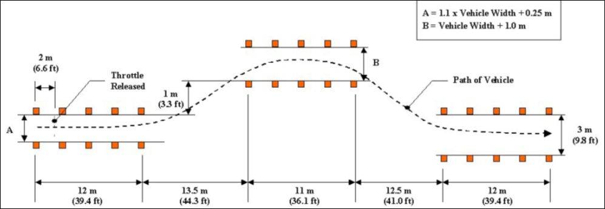

# Using MAVS to Compare the RP3D and Chrono Vehicle Simulation

This example will show how to create a MAVS-Chrono vehicle and a MAVS-RP3D vehicle and simulataneously simulate a double-lane change test with each model for the sake of comparison.

This test uses the ISO-3888 lane change test as shown in the following figure.



In the test, the vehicle accelerates to the steady-state test speed before it enters the course. When it enters the course, the throttle is released and the driver attempts to navigate the prescribed lanes.

The code for this example can be found in mavs source directory under "src/mavs_python/examples/rp3d_chrono_compare.py". 

## The code
Copy "mavs/src/mavs_python/examples/rp3d_chrono_compare.py" to
a directory outside of your source tree and rename it to "my_rp3d_chrono_example.py".
```python
# This file runs a MAVS-RP3D vehicle and a MAVS-Chrono vehicle through a 
# double lane change at the same time for purposes of comparison
import matplotlib
import matplotlib.pyplot as plt
import time
import sys
# Set the path to the mavs python api, mavs.py
sys.path.append(r'C:/Users/cgoodin/Desktop/vm_shared/shared_repos/mavs/src/mavs_python')
# Load the mavs python modules
import mavs_interface as mavs
import mavs_python_paths
# Set the path to the mavs data folder
mavs_data_path = mavs_python_paths.mavs_data_path

# define the speeds to test
speeds = [5.0, 12.0, 20.0] # m/s
start_point = -100.0 # Ramp up lane length, course starts at x=0.0
render_debug = True

# Define the waypoints for the double lane change maneuver
waypoints =[[0,0],[2,0],[4,0],[6,0],[8,0],[10,0],[12,0],
            [13.5,0.4326],[15,0.8651],[16.5,1.2977],[18,1.7302],
            [19.5,2.1628],[21,2.5953],[22.5,3.0279],[24,3.4604],
            [25.5,3.893],[26.5,3.893],[27.5,3.893],[28.5,3.893],
            [29.5,3.893],[30.5,3.893],[31.5,3.893],[32.5,3.893],
            [33.5,3.893],[34.5,3.893],[35.5,3.893],[36.5,3.893],
            [38,3.42584],[39.5,2.95868],[41,2.49152],[42.5,2.02436],
            [44,1.5572],[45.5,1.09004],[47,0.62288],[48.5,0.15572],
            [49,0],[51,0],[53,0],[55,0],[57,0],[59,0],[61,0]]

for test_speed in speeds:
    # Set the timeout value based on desired speed 
    max_time = 2.0*(61.0-start_point)/test_speed

    # Select a scene and load it
    mavs_scenefile = "/scenes/lane_change_scene.json"
    scene = mavs.MavsEmbreeScene()
    scene.Load(mavs_data_path+mavs_scenefile)

    # Create a MAVS environment and add the scene to it
    env = mavs.MavsEnvironment()
    env.SetScene(scene.scene)

    # add the rendering of the chrono vehicle to the simulation
    env.AddActor(mavs_data_path+'/actors/actors/red_hmmwv_actor.json',False)

    # Create and load a RP3D vehicle
    rp3d_veh = mavs.MavsRp3d()
    rp3d_veh_file = 'hmmwv_rp3d.json'
    rp3d_veh.Load(mavs_data_path+'/vehicles/rp3d_vehicles/' + rp3d_veh_file)
    rp3d_veh.SetInitialPosition(-100.0, 0.0, 0.0) # in global ENU
    rp3d_veh.SetInitialHeading(0.0) # in radians
    rp3d_veh.SetUseDrag(False)
    rp3d_veh.Update(env, 0.0, 0.0, 1.0, 0.000001)
    # Create and load the chrono vehicle
    chrono_veh = mavs.ChronoVehicle() 
    chrono_veh_file = 'hmmwv.json'
    chrono_veh.SetInitialPosition(-100.0, 0.0, 1.0) # in global ENU
    chrono_veh.SetInitialHeading(0.0) # in radians
    chrono_veh.Load(mavs_data_path+'/vehicles/chrono_inputs/' + chrono_veh_file)
    chrono_veh.Update(env, 0.0, 0.0, 1.0, 0.000001)

    # Create a vehicle controller for the RP3D vehicle
    rp3d_controller = mavs.MavsVehicleController()
    rp3d_controller.SetDesiredSpeed(test_speed) # m/s 
    rp3d_controller.SetSteeringScale(1.0)
    rp3d_controller.SetWheelbase(2.4) # meters
    rp3d_controller.SetMaxSteerAngle(0.855) # radians
    rp3d_controller.SetDesiredPath(waypoints)
    # Create the controller for the Chrono vehicle
    chrono_controller = mavs.MavsVehicleController()
    chrono_controller.SetDesiredSpeed(test_speed) # m/s 
    chrono_controller.SetSteeringScale(1.0)
    chrono_controller.SetWheelbase(2.4) # meters
    chrono_controller.SetMaxSteerAngle(0.855) # radians
    chrono_controller.SetDesiredPath(waypoints)

    # Create cameras for viewing the simulation
    rear_cam = mavs.MavsCamera()
    rear_cam.Initialize(256,256,0.0035,0.0035,0.0035)
    rear_cam.SetOffset([-10.0,0.0,3.0],[1.0,0.0,0.0,0.0])
    rear_cam.SetGammaAndGain(0.5,2.0)
    rear_cam.RenderShadows(True)
    side_cam = mavs.MavsCamera()
    side_cam.Initialize(256,256,0.0035,0.0035,0.0035)
    side_cam.SetOffset([0.0, 15.0, 3.0],[0.7071,0.0,0.0, -0.7071])
    side_cam.SetGammaAndGain(0.5,2.0)
    side_cam.RenderShadows(True)

    # open files for writing out results
    f_rp3d = open("rp3d_out_"+str(test_speed)+".txt","w")
    f_chrono = open("chrono_out_"+str(test_speed)+".txt","w")

    rp3d_x = []
    rp3d_y = []
    chrono_x = []
    chrono_y = []

    # Start the simulation main loop
    dt = 1.0/100.0 # time step, seconds
    n = 0 # loop counter
    elapsed_time = 0.0
    while (elapsed_time<max_time):
        # Get driving commands for the rp3d vehicle
        rp3d_controller.SetCurrentState(rp3d_veh.GetPosition()[0],rp3d_veh.GetPosition()[1],rp3d_veh.GetSpeed(),rp3d_veh.GetHeading())
        rp3d_dc = rp3d_controller.GetDrivingCommand(dt)
        rp3d_position = rp3d_veh.GetPosition()
        rp3d_orientation = rp3d_veh.GetOrientation()

        # Getdriving commands for the Chrono vehicle
        chrono_controller.SetCurrentState(chrono_veh.GetPosition()[0],chrono_veh.GetPosition()[1],chrono_veh.GetSpeed(),chrono_veh.GetHeading())
        chrono_dc = chrono_controller.GetDrivingCommand(dt)
        chrono_position = chrono_veh.GetPosition()
        chrono_orientation = chrono_veh.GetOrientation()

        # Perform some simulation control checks
        if (n<100): 
            # 1 second of "settle" time
            rp3d_dc.throttle = 0.0
            chrono_dc.throttle = 0.0
        if (rp3d_position[0]>=0.0): 
            # release throttle at course start
            rp3d_dc.throttle = 0.0
        if (chrono_position[0]>=0.0): 
            # release throttle at course start
            chrono_dc.throttle = 0.0
        if (chrono_veh.GetSpeed()>test_speed): 
            # Chrono vehicle needs brakes or it will go over set speed
            chrono_dc.braking = 0.1
            chrono_dc.throttle = 0.0
        if (chrono_position[0]>=61.0 and rp3d_position[0]>61.0): 
            # end sim when both vehicles reach course end
            break
         
        # Update both vehicles at 100 Hz
        rp3d_veh.Update(env, rp3d_dc.throttle, rp3d_dc.steering, rp3d_dc.braking, dt)
        chrono_veh.Update(env, chrono_dc.throttle, chrono_dc.steering, chrono_dc.braking, dt)

        # Write output and show debug at 10 Hz
        if n%10==0:
            # Write the vehicle position and speed to a file
            f_rp3d.write(str(elapsed_time)+" "+str(rp3d_position[0])+" "+str(rp3d_position[1])+" "+str(rp3d_veh.GetSpeed())+"\n")
            f_chrono.write(str(elapsed_time)+" "+str(chrono_position[0])+" "+str(chrono_position[1])+" "+str(chrono_veh.GetSpeed())+"\n")
            
            # Add data to arrays for plotting later
            rp3d_x.append(rp3d_position[0])
            rp3d_y.append(rp3d_position[1])
            chrono_x.append(chrono_position[0])
            chrono_y.append(chrono_position[1])

            # Write out the vehicle speeds for debugging purposes
            print(rp3d_veh.GetSpeed(),chrono_veh.GetSpeed())
            sys.stdout.flush()

            if render_debug:
                # Update the animated vehicle position
                env.SetActorPosition(0,rp3d_position,rp3d_orientation)
                env.SetActorPosition(1,chrono_position,chrono_orientation)

                # Update the camera views
                rear_cam.SetPose(rp3d_position,rp3d_orientation)
                rear_cam.Update(env,dt)
                rear_cam.Display()
                side_cam.SetPose(rp3d_position,rp3d_orientation)
                side_cam.Update(env,dt)
                side_cam.Display()

        # Update the loop counter
        n = n+1
        elapsed_time = elapsed_time + dt

    # Plot the path taken by each vehicle
    plt.plot(chrono_x, chrono_y)
    plt.plot(rp3d_x, rp3d_y)
    plt.xlim([0.0,60.0])
    plt.ylim([0.0,5.0])
    plt.show()

    # Close the data files
    f_rp3d.close()
    f_chrono.close()
```

## The explanation

In this section we'll break down the code piece by piece.

The first few lines load the required python modules.
Note that in your code you will need to edit line 8 to be the full path to the directory of your mavs installation. Because we'll be loading an existing MAVS scene and vehicle file, it helps to also define the *mavs_data_path variable*. In addition, because we'll be plotting some data, we import the python plotting library.
```python
# This file runs a MAVS-RP3D vehicle and a MAVS-Chrono vehicle through a 
# double lane change at the same time for purposes of comparison
import matplotlib
import matplotlib.pyplot as plt
import time
import sys
# Set the path to the mavs python api, mavs.py
sys.path.append(r'C:/Users/cgoodin/Desktop/vm_shared/shared_repos/mavs/src/mavs_python')
# Load the mavs python modules
import mavs_interface as mavs
import mavs_python_paths
# Set the path to the mavs data folder
mavs_data_path = mavs_python_paths.mavs_data_path
```

The next few lines define the speeds we want to simulate in m/s. The start point is the starting x-coordinate. Since the vehicle will be traveling the positive x-direction, this is essentially the distance of the ramp-up lane. The *render_debug* variable turns rendering on or off. 
```python
# define the speeds to test
speeds = [5.0, 12.0, 20.0] # m/s
start_point = -100.0 # Ramp up lane length, course starts at x=0.0
render_debug = True
```

Next, the list of waypoints that the vehicle controller will attempt to follow is defined. These are standard for a HMMWV in a double lane change test.
```python
# Define the waypoints for the double lane change maneuver
waypoints =[[0,0],[2,0],[4,0],[6,0],[8,0],[10,0],[12,0],
            [13.5,0.4326],[15,0.8651],[16.5,1.2977],[18,1.7302],
            [19.5,2.1628],[21,2.5953],[22.5,3.0279],[24,3.4604],
            [25.5,3.893],[26.5,3.893],[27.5,3.893],[28.5,3.893],
            [29.5,3.893],[30.5,3.893],[31.5,3.893],[32.5,3.893],
            [33.5,3.893],[34.5,3.893],[35.5,3.893],[36.5,3.893],
            [38,3.42584],[39.5,2.95868],[41,2.49152],[42.5,2.02436],
            [44,1.5572],[45.5,1.09004],[47,0.62288],[48.5,0.15572],
            [49,0],[51,0],[53,0],[55,0],[57,0],[59,0],[61,0]]
```

Next, we create a loop over all the test speeds.
```python 
for test_speed in speeds:
```

We want to set a timeout value to avoid an infinite simulation. The course length is 61 meters, plus the length of the ramp up lane. We estimate the timeout to traverse the course length at the desired speed.
```python
    # Set the timeout value based on desired speed 
    max_time = 2.0*(61.0-start_point)/test_speed
```


The next few lines create a MAVS scene and environment and add the MAVS scene to the environment. 
```python
    # Select a scene and load it
    mavs_scenefile = "/scenes/lane_change_scene.json"
    scene = mavs.MavsEmbreeScene()
    scene.Load(mavs_data_path+mavs_scenefile)

    # Create a MAVS environment and add the scene to it
    env = mavs.MavsEnvironment()
    env.SetScene(scene.scene)
```

The next lines load both a [MAVS vehicle file](../../Vehicles/MavsVehicles.md) and Chrono vehicle and place them in the scene. Note that for MAVS-RP3D vehicles, the visualization mesh is automatically created when the vehicle is loaded. This is not the case for Chrono vehicles. Therefore, the first step is to add an actor to the environment.
```python
    # add the rendering of the chrono vehicle to the simulation
    env.AddActor(mavs_data_path+'/actors/actors/red_hmmwv_actor.json',False)
```

Next, both the RP3D and Chron vehicles are created and added. Note that the *SetUseDrag* function is called for the RP3D vehicle and the drag is turned off. This is to match the Chrono simulation, which does not have drag or motion resistance. The call to *vehicle.Update* is made with a small timestep to allow the simulation to load and initialize the vehicle before the simulation loop begins.
```python
    # Create and load a RP3D vehicle
    rp3d_veh = mavs.MavsRp3d()
    rp3d_veh_file = 'hmmwv_rp3d.json'
    rp3d_veh.Load(mavs_data_path+'/vehicles/rp3d_vehicles/' + rp3d_veh_file)
    rp3d_veh.SetInitialPosition(start_point, 0.0, 0.0) # in global ENU
    rp3d_veh.SetInitialHeading(0.0) # in radians
    rp3d_veh.SetUseDrag(False)
    rp3d_veh.Update(env, 0.0, 0.0, 1.0, 0.000001)
    # Create and load the chrono vehicle
    chrono_veh = mavs.ChronoVehicle() 
    chrono_veh_file = 'hmmwv.json'
    chrono_veh.SetInitialPosition(start_point, 0.0, 1.0) # in global ENU
    chrono_veh.SetInitialHeading(0.0) # in radians
    chrono_veh.Load(mavs_data_path+'/vehicles/chrono_inputs/' + chrono_veh_file)
    chrono_veh.Update(env, 0.0, 0.0, 1.0, 0.000001)
``` 

Next, the vehicle controllers are created. The controllers are identical for the two vehicle models.
```python
    # Create a vehicle controller for the RP3D vehicle
    rp3d_controller = mavs.MavsVehicleController()
    rp3d_controller.SetDesiredSpeed(test_speed) # m/s 
    rp3d_controller.SetSteeringScale(1.0)
    rp3d_controller.SetWheelbase(2.4) # meters
    rp3d_controller.SetMaxSteerAngle(0.855) # radians
    rp3d_controller.SetDesiredPath(waypoints)
    # Create the controller for the Chrono vehicle
    chrono_controller = mavs.MavsVehicleController()
    chrono_controller.SetDesiredSpeed(test_speed) # m/s 
    chrono_controller.SetSteeringScale(1.0)
    chrono_controller.SetWheelbase(2.4) # meters
    chrono_controller.SetMaxSteerAngle(0.855) # radians
    chrono_controller.SetDesiredPath(waypoints)
```

Next, the cameras are created. They are used for debugging/visualization purposes only.
```python 
    # Create cameras for viewing the simulation
    rear_cam = mavs.MavsCamera()
    rear_cam.Initialize(256,256,0.0035,0.0035,0.0035)
    rear_cam.SetOffset([-10.0,0.0,3.0],[1.0,0.0,0.0,0.0])
    rear_cam.SetGammaAndGain(0.5,2.0)
    rear_cam.RenderShadows(True)
    side_cam = mavs.MavsCamera()
    side_cam.Initialize(256,256,0.0035,0.0035,0.0035)
    side_cam.SetOffset([0.0, 15.0, 3.0],[0.7071,0.0,0.0, -0.7071])
    side_cam.SetGammaAndGain(0.5,2.0)
    side_cam.RenderShadows(True)
```

We want to both save data and make plots for immediate feedback. Two files are opened for the RP3D and Chrono models. New files will be created for each speed. In addition, some empty arrays that will be used to plot the vehicle path are initialized.
```python
    # open files for writing out results
    f_rp3d = open("rp3d_out_"+str(test_speed)+".txt","w")
    f_chrono = open("chrono_out_"+str(test_speed)+".txt","w")

    rp3d_x = []
    rp3d_y = []
    chrono_x = []
    chrono_y = []
```

The simulation loop for this test speed is created. Some loop counting / simulation tracking timers are initialized. The simulation will update at 100 Hz.
```python
    # Start the simulation main loop
    dt = 1.0/100.0 # time step, seconds
    n = 0 # loop counter
    elapsed_time = 0.0
    while (elapsed_time<max_time):
```

The current vehicle state is used to get an updated position from the vehicle controller at each time step.
```python
        # Get driving commands for the rp3d vehicle
        rp3d_controller.SetCurrentState(rp3d_veh.GetPosition()[0],rp3d_veh.GetPosition()[1],rp3d_veh.GetSpeed(),rp3d_veh.GetHeading())
        rp3d_dc = rp3d_controller.GetDrivingCommand(dt)
        rp3d_position = rp3d_veh.GetPosition()
        rp3d_orientation = rp3d_veh.GetOrientation()

        # Getdriving commands for the Chrono vehicle
        chrono_controller.SetCurrentState(chrono_veh.GetPosition()[0],chrono_veh.GetPosition()[1],chrono_veh.GetSpeed(),chrono_veh.GetHeading())
        chrono_dc = chrono_controller.GetDrivingCommand(dt)
        chrono_position = chrono_veh.GetPosition()
        chrono_orientation = chrono_veh.GetOrientation()
```

By design, the vehicle throttle is released at the start of the lane-change course. The next lines ensure that the throttle is released appropriately. They also ensure that the vehicles have a 1.0 second "settle-time" after the simulation initialization. Finally, a check is added to end the loop if both vehicles have finished the course.
```python
        # Perform some simulation control checks
        if (n<100): 
            # 1 second of "settle" time
            rp3d_dc.throttle = 0.0
            chrono_dc.throttle = 0.0
        if (rp3d_position[0]>=0.0): 
            # release throttle at course start
            rp3d_dc.throttle = 0.0
        if (chrono_position[0]>=0.0): 
            # release throttle at course start
            chrono_dc.throttle = 0.0
        if (chrono_veh.GetSpeed()>test_speed): 
            # Chrono vehicle needs brakes or it will go over set speed
            chrono_dc.braking = 0.1
            chrono_dc.throttle = 0.0
        if (chrono_position[0]>=61.0 and rp3d_position[0]>61.0): 
            # end sim when both vehicles reach course end
            break
```

Both vehicles are updated using the calculated driving commands.
```python
        # Update both vehicles at 100 Hz
        rp3d_veh.Update(env, rp3d_dc.throttle, rp3d_dc.steering, rp3d_dc.braking, dt)
        chrono_veh.Update(env, chrono_dc.throttle, chrono_dc.steering, chrono_dc.braking, dt)
```

At 10 Hz, the simulation data is logged and the visualzation is updated.
```python
        # Write output and show debug at 10 Hz
        if n%10==0:
            # Write the vehicle position and speed to a file
            f_rp3d.write(str(elapsed_time)+" "+str(rp3d_position[0])+" "+str(rp3d_position[1])+" "+str(rp3d_veh.GetSpeed())+"\n")
            f_chrono.write(str(elapsed_time)+" "+str(chrono_position[0])+" "+str(chrono_position[1])+" "+str(chrono_veh.GetSpeed())+"\n")
            
            # Add data to arrays for plotting later
            rp3d_x.append(rp3d_position[0])
            rp3d_y.append(rp3d_position[1])
            chrono_x.append(chrono_position[0])
            chrono_y.append(chrono_position[1])
```

The vehicle speeds are printed to the terminal for debugging purposes.
```python
            # Write out the vehicle speeds for debugging purposes
            print(rp3d_veh.GetSpeed(),chrono_veh.GetSpeed())
            sys.stdout.flush()
```

If *render_debug=True*, the animation positions are updated and the cameras rendered and displayted.
```python
            if render_debug:
                # Update the animated vehicle position
                env.SetActorPosition(0,rp3d_position,rp3d_orientation)
                env.SetActorPosition(1,chrono_position,chrono_orientation)

                # Update the camera views
                rear_cam.SetPose(rp3d_position,rp3d_orientation)
                rear_cam.Update(env,dt)
                rear_cam.Display()
                side_cam.SetPose(rp3d_position,rp3d_orientation)
                side_cam.Update(env,dt)
                side_cam.Display()
```

The loop counter and elapsed time are updated.
```python
        # Update the loop counter
        n = n+1
        elapsed_time = elapsed_time + dt
```

Finally, for each test speed, the results are plotted and the data file closed.
```python
    # Plot the path taken by each vehicle
    plt.plot(chrono_x, chrono_y)
    plt.plot(rp3d_x, rp3d_y)
    plt.xlim([0.0,60.0])
    plt.ylim([0.0,5.0])
    plt.show()

    # Close the data files
    f_rp3d.close()
    f_chrono.close()
```

### Running the program

To run the program, open a terminal in the directory that contains the script and type:
```bash
$python my_rp3d_chrono_example.py
```
If the code is running correctly, a display window like the one below will appear. When the window is active, you can drive the vehicle with the WASD keys. Press *Ctrl-C* in the terminal to stop the simulation.

