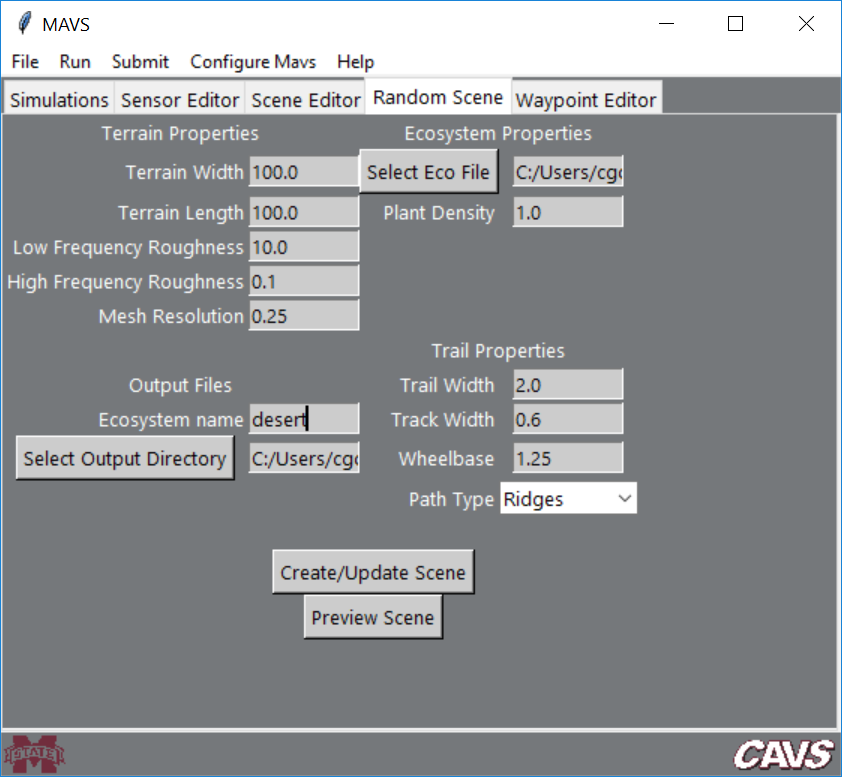

# Generating Random Data with the GUI
The MAVS GUI allows you to create a randomized scene and path automatically. The user needs to define some parameters like the surface roughness and dimensions, the ecosystem type, and the parameters of the trail through the environment.

The MAVS random scene generator first creats a terrain with user-specified surface roughness parameters. It then generates a path through that terrain, either following the highest or lowest elevation paths through the scene. Finally, an ecosystem is grown around the path to create a trail through the randomly generated scene.

To create a random simulation, open the MAVS GUI, and navigation to the *Random Scene* tab, shown below. As with all tabs in the MAVS GUI, tooltips can be accessed by hoevering the cursor over a field/button.


To create a scene, first specify the desired properties in each field, then click the *Create/Update Scene* button. Once you have created a scene, you can click the *Preview Scene* button to open a low resolution rendering window. When the window is active, you can "fly" through the scene using the WASD keys and the arrow keys. Once you are finished with the preview, close the preview window. After you modify any of the scene features, click *Create/Update Scene* to save the new modified scene.

## Terrain Properties
First define the *Terrain Width* and *Terrain Length* (in the **x** and **y** directions, respectively) in meters. Next, define the magnitude of the  *Low Frequency Roughness* and *High Frequency Roughness* in the scene, in meters. Low frequency roughness creates hills in the terrain with feature lengths of 50 meters. High frequency roughness is occurs at 1 meter length scales and creates a bumpy or smooth terrain. Finally, specify the *Mesh Resolution* in meters. Note that the number of facets in the mesh will be 2x*Terrain Width*x*Terrain Length*/*Mesh Resolution*, so decreasing the resolution too much could result in a very large mesh.

## Ecosystem Properties
Vegetation is added to the scene by using an [ecosystem simulation](../Environment/MavsEcosystemSimulation.md) to grow plants over a number of years. Ecosystem input files are located in the MAVS data directory in *data/ecosystem_files*. Specify the ecosystem input file by clicking the *Select Eco File* button. The *Plant Density* is a multiplying factor for the number of new plants per square meter that are added to the simulation each year. Note that because the plants compete with each other, doubling this factor may not double the number of plants in the final scene, and in fact a limit will eventually be reached.

## Trail Properties
MAVS will automatically create a trail through the scene. You can specify if you would like the trail to follow the high-ground or low-ground by choosing *Ridges* or *Valleys* from the *Path Type* dropdown menu. The other trail properties are the *Trail Width* in meters, the *Track Width* (width of the tire tracks on the trail) in mters, and the *Wheelbase* (distance between the tire tracks) in meters.

## Output Files
The MAVS random scene generator will save an ANVEL vehicle replay file (.vprp), a surface mesh file (.obj) and a MAVS scene file (.json). It will also save a "ground-truth" file (.txt), which is a space-delimited column file that lists information about each plant. The columns are 
```
X Y Height SpeciesNum SpeciesName
```
These files are saved in the directory specified by clicking the *Select Output Directory* button. The files can be given a user defined prefix by editing the *Ecosystem Name* field.

## Running a simulation with the Random Scene
Once the random scene is created, navigate to the *Simulations* tab and choose the [*Sensor Analysis* sub-tab](./RunningMavsGUI.md). Choose the *Pose file* and *Scene file* to be the ones you have just created, and select the pose file type to be *ANVEL*. Complete the rest of the fields as usual and run the simulation by clicking *Run->Sensor Simulation*.