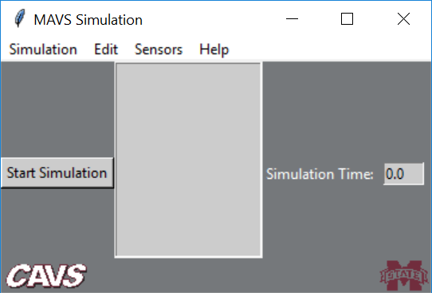
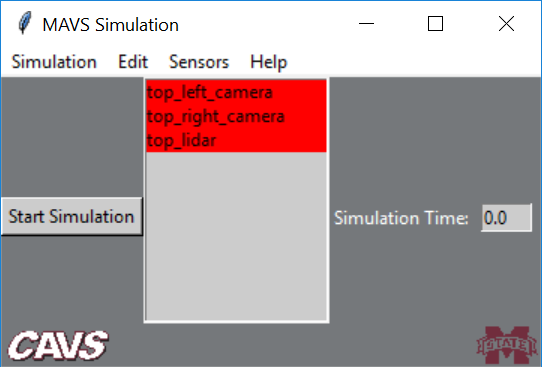
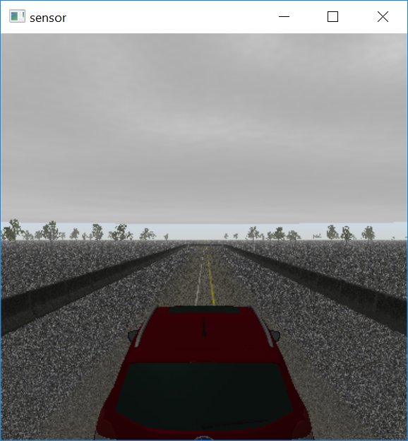
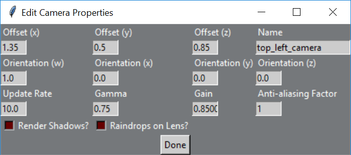

# Running the MAVS GUI
The MAVS gui is based on Python3 with Tkinter. You will need to [install python](https://www.python.org/downloads/) on your Windows/Linux system for the GUI to work. 

- [Launching the GUI](##launching-the-gui)
  * [Windows](###windows)
  * [Linux](###linux)  
- [GUI Overview](##gui-overview)
- [Driving the Vehicle](##driving-the-vehicle)
- [Editing and Activating Sensors](##editing-and-activating-sensors)
- [Adding/Deleting Sensors](##adding-and-deleting-sensors)
- [Choosing the Output Directory](##choosing-the-output-directory)
- [Changing the Scene, Vehicle, and Waypoints](##changing-the-scene-vehicle-and-waypoints)
- [Editing the Environment, Controller, and Waypoints](##editing-the-environment-controller-and-waypoints)
- [Displaying Additional Simulation Data](##displaying-additional-simulation-data)
- [Saving a Simulation](##saving-a-simulation)

Additionally, there is a separate GUI for [viewing MAVS materials](TheMaterialViewerGui.md).

## Launching the GUI

Once MAVS is [built and installed](../MavsBuildInstructions.md), the Mavs gui is launched from the command line.

### Windows
In Windows, the GUI is launched with the command
```
> /path_to_mavs_build/bin/mavs_gui.cmd
```
Alternatively, you can create a Desktop shortcut to /mavs/build/bin/mavs_gui, then simply double click the shortcut icon.

### Linux
In Linux, the GUI is launched with the command
```
> /path_to_mavs_build/bin/mavs_gui.sh
```

## GUI Overview
All widgets and fields on the GUI are equipped with tooltips. Just hover your mouse pointer over a widget or field to get a tip about what it does. When the GUI is launched, you will see the following screen


To load a simulation, go to *Simulation->Load Simulation* and select the file to load from the MAVS *sensor_sims* directory. When a simulation is loaded, a list of sensors will appear in the sensor listbox.


To start the simulation, click the *Start Simulation* button. The vehicle will appear in the simulation window. A view of the initial screen of the *halo_ncap_sim.json* is shown below.


The GUI provides access to the following components
* Scene - The geometry of the environment, including all the objects and plants
* Environment - The environmental conditions like weather
* Vehicle - The vehicle platform to simulate
* Sensors - A list of all the sensors on the vehicle
* Waypoints - A path for the vehicle to follow
* Vehicle Controller - Issues throttle/steering commands to follow the waypoints

## Driving the Vehicle
By default, the vehicle is driven with the WASD keys. To have the vehicle automatically follow the loaded waypoints, uncheck *Simulation->Keyboard Vehicle Control*.

## Editing and Activating Sensors
To edit a sensor, double click an entry in the sensor listbox, and a window allowing you to edit the properties of the sensor such as the offset and update rate will appear. The simulation will pause until you are done editing. When you are finished editing, click *Done*


To activate a sensor or save sensor data, highlight the sensor with the left mouse button, then right-click the highlighted sensor. A menu of save options will appear. Note that the entries in the listbox are colored according to their state.
* Red = Inactive/Off
* Green = Active/On, not saving 
* Blue = Active/On, saving raw data
* Purple = Active/On, saving labeled data 

## Adding and Deleting Sensors
To add a sensor, select *Sensors->Add Sensor->Add sensor_type*. You will be prompted to select from a list of available sensors for each type. Once you've made your selection, click *Done* and the sensor will be added.

To delete a sensor, highlight the sensor you want to remove and press the "Delete" key.

## Choosing the Output Directory
To choose the location where sensor data will be saved, select *Simulation->Set Output Directory* and choose the directory.

## Changing the Scene, Vehicle, and Waypoints
To load a new scene, select *Edit->Load->Load New Scene* and select a scene from the MAVS *scenes* directory.

To load a new vehicle, select *Edit->Load->Load New Vehicle* and select a vehicle dynamics model from the MAVS *vehicles/rp3d_vehicles* directory.

To load a new set of wayoints, select *Edit->Load->Load New Scene* and select a waypoints file from the MAVS *waypoints* directory. Note that the input waypoints must be in .vprp format.

### Editing the Environment, Controller, and Waypoints
The controller, environment, and waypoints can all be edited dynamically through the *Edit->Edit* menu. A popup window will appear. Editing the waypoints and controller will automatically pause the simulation, while editing environment properties is done while the simulation continues to run.

### Displaying Additional Simulation Data
Additional information about the simulation state, including the timing information of different components, can be accessed through the *Edit->Display* menu.

### Saving a Simulation
After editing a simulation, a new simulation can be saved by selecting *Simulation->Save Simulation*. Simulations will be placed in the MAVS *sims/sensor_sims* folder by default, although you can save them anywhere and still load it for future use.