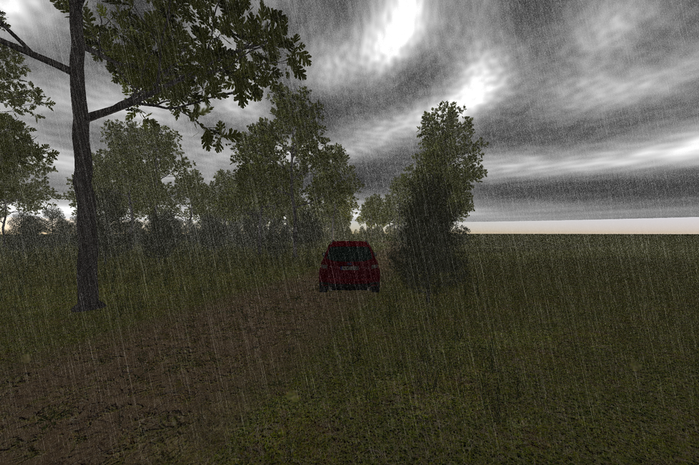
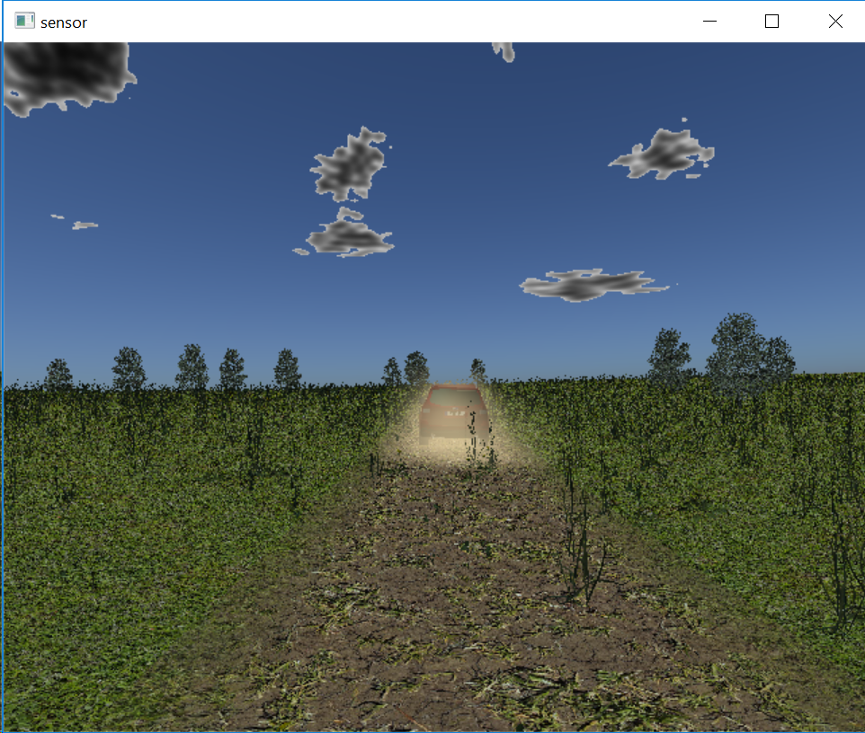

# MAVS - Python
This page documents the MAVS Python API including the basic python objects and API calls. In order to use the python interface, MAVS must be [built and installed](../MavsBuildInstructions) on your system.

[Detailed API documentation](https://cgoodin.gitlab.io/msu-autonomous-vehicle-simulator/mavs__interface_8py.html) is available for developers.

* [Importing MAVS into Python](#importing-mavs-into-python)
* [Creating and Environment and Loading a Scene](#Creating-and-Environment-and-Loading-a-Scene)
  - [Load an Existing Scene](#Load-an-Existing-Scene)
  - [Generate a Scene](#Generate-a-Scene)
* [Modifying Environment Properties](#Modifying-Environment-Properties)
  - [Atmosphere and Weather](#Atmosphere-and-Weather)
  - [Adding an Actor](#Adding-an-Actor)
  - [Updating the Dynamic Scene](#Updating-the-Dynamic-Scene)
* [Sensors](#Sensors)
  - [Camera](#Camera)
  - [Lidar](#Lidar)
  - [Radar](#Radar)
* [Running a Simulation](#Running-a-Simulation)

## Importing MAVS into Python
A few steps arfe required to import MAVS into python. First you must tell python where to find the shared library with the MAVS interaces. Next, you must import the appropriate modules.
``` python
import sys
# Set the path to the mavs python api, mavs_interface.py
# This will be different for every user and will depend on where you installed mavs
sys.path.append(r'C:\Users\cgoodin\Desktop\code\mavs\src\mavs_python')

# Load the mavs python modules
import mavs_interface
import mavs_python_paths
```

## Creating and Environment and Loading a Scene
There are two ways to create a scene. The first is to load an existing scene from the MAVS database. The second is to generate a new scene with the MAVS ecosystem generation API.

### Load an Existing Scene
In order to load one of the existing MAVS scenes, you must tell python where the MAVS database is located. Once a scene is loaded, it can be added to an environment
``` python
# Set the path to the mavs data folder
mavs_data_path = mavs_python_paths.mavs_data_path

# Select a scene and load it
mavs_scenefile = "/scenes/forest_ecosystem_scene.json"
scene = mavs_interface.MavsEmbreeScene()
scene.Load(mavs_data_path+mavs_scenefile)

# Create a MAVS environment and add the scene to it
env = mavs_interface.MavsEnvironment()
env.SetScene(scene.scene)
```

### Generate a Scene
To create a random scene, you must define features such as the type of ecosystem, the roughness of the terrain, and the size of the terrain.
``` python
# create a randomized mavs scene
random_scene = mavs_interface.MavsRandomScene()
#set the length and width of the terrain (meters)
random_scene.terrain_width = 50.0
random_scene.terrain_length = 50.0
# set the height of the low-frequency roughness (rolling hills)
random_scene.lo_mag = 0.0
# set the height of the high-frequency roughness (rough terrain)
random_scene.hi_mag = 0.0
# set the relative density of othe plants, from 0 to 1 (1 is a lot of plants!)
random_scene.plant_density = 0.1
#select the name of the scene, doesn't really matter too much
random_scene.basename = 'my_scene'
#select the ecosystem file to use, uncomment the one you want
#'american_southeast_meadow.json', 'american_southwest_desert.json'
random_scene.eco_file = 'american_southeast_forest.json'
# Create the scene using the specified parameters
random_scene.CreateScene()
```
Once the scene is created, you must create an environment and add it to the scene to it.
``` python
# Create a MAVS environment and add the scene to it
env = mavs_interface.MavsEnvironment()
env.SetScene(random_scene.scene)
```
When a you generate a random MAVS scene, a path through the scene is also automatically created. You need to load that path for use with the simulation.
``` python
#--- Load the waypoints that go with this scene ----#
waypoints = mavs_interface.MavsWaypoints()
waypoints.Load('./'+random_scene.basename+'_path.vprp')
```

### Adding labeling to the scene
If you are using MAVS to generate labeled sensor data, you must set the scene to use labeling.
``` python
scene.TurnOnLabeling()
```

## Modifying Environment Properties
There are a number of atmoshperic and environmental properties that can be modified through the API.

### Atmosphere and Weather
The atmosphere and weather have three main properties. The cloud cover fraction should range between 0.0 (clear) and 1.0 (completely cloudy). The rain rate can take any positive value, but typical rain rates are from 0.0-25.0 mm/h. Finally, the turbidity is a measure of the haziness of the atmosphere and ranges from 2.0 (no haze) to 10.0 (very hazy).
``` python
env.SetCloudCover(cloud_cover)
env.SetTurbidity(turbidity)
env.SetRainRate(10.0)
```
The following image is with rain rate of 9.5 mm/h, turbidity=9.0, and cloud cover = 1.0.


### Adding an Actor 
Actors in MAVS are anything in the scene that moves. Actor files define the mesh associated with the actor and other properties. To define an actor, the actor file must be loaded, the actor object added to the scene, and desired actor properties set.
``` python
#---- Load the actor file and add it to the environment ----#
mavs_actorfile = "/actors/forester_actor.json"
actornum = env.AddActor(mavs_data_path+mavs_actorfile)
#---- Make the actor dusty -----#
env.AddDustToActor(actornum)
```

### Updating the Dynamic Scene
The MAVS scene may have dynamic elements like actors or particle systems (dust). These should be updated at each time step. The actor state can be updated explicitly, while the particle system needs to be stepped forward in time.
``` python
#---- Define the new position and orientation of the actor ----#
pos = [0.0, 0.0, 2.0]
orient = [1.0, 0.0, 0.0, 0.0]
#---- Move the actor to the new position ----#
env.SetActorPosition(actornum, position, orient)
#---- Update all particle systems at a given time step----#
dt = 0.1
env.UpdateParticleSystems(dt)
```
An example of simulation with dust added to a vehicle actor is shown below.


## Sensors
The RGB camera sensor and the lidar sensor are currently accessible through the python API. These sensors share a base class with some common methods, as well as methods unique to each sensor modality.

### Camera
A MAVS camera must be created and initialized. Several options can be set to control various aspects of the rendering
``` python
#---- Create a MAVS camera and initialize it ----#
cam = mavs_interface.MavsCamera()
# Initialize() arguments are: 
#  horizontal pixels 
#  vertical pixels
#  horizontal detector size (meters)
#  vertical detector size (meters)
#  focal length (meters)
cam.Initialize(1620,1080,0.006784,0.0054272,0.004)

# Offset is defined as the offset from the CG of the vehicle
# First array is the position offset in the vehicle frame
# Second array is the quaternion [w,x,y,z] defining the orientation relative to vehicle
cam.SetOffset([0.0,0.0,1.0],[1.0,0.0,0.0,0.0])

# Set various options for the camera
cam.RenderShadows(True)
# Anti aliasing is the pixel-oversampling factor, default is 1
cam.SetAntiAliasingFactor(2)
# Tell camera about environment properties like turbidity
cam.SetEnvironmentProperties(env.obj)
# Set this to true to render raindrops on the lens of the camera
cam.SetDropsOnLens(True)
```

Once the camera is created, it can be updated with the following commands
``` python
# Set the pose of the camera and render the frame
# Arguments are position and orientation of the vehicle CG
# in world coordinates
cam.SetPose([0.0,0.0,0.0],[1.0,0.0,0.0,0.0])
# 2nd argument is the time step
cam.Update(env,0.03)

# Display the frame and save the image to a file
cam.Display()
# If labeling has been turned on, labeled images can be saved
cam.SaveAnnotation(env.obj,"annotated_python_image")
# Save the camera image to a file
cam.SaveCameraImage("mavs_python_image.bmp")
```

### Lidar
A lidar can be created similar to a camera. 
``` python
lidar = mavs_interface.MavsLidar('HDL-32E')
lidar.SetOffset([0.0,0.0,1.75],[1.0,0.0,0.0,0.0])
```
The argument to the lidar constructor must be one of the following strings.
* "M8"
* "HDL-64E"
* "HDL-32E"
* "VLP-16"
* "OS1"
* "OS2"
* "LMS-291"
* "RS32"

The lidar can be updated with the following commands
``` python
#---- Set the pose where p is the global position and q the orientation of the base vehicle -----#
lidar.SetPose(p,q)
#---- Update the sensor, the second argument is the time step ----#
lidar.Update(env,0.1)
#--- Display a top-down view of the point cloud ----#
lidar.Display()
#--- Save column text file with x,y,z, intensity, r,g,b
lidar.SaveColorizedPointCloud("cloud.txt")
#---- Save a rendering of the point cloud ----#
lidar.SaveLidarImage("cloud.bmp") 
```

Output files can also be saved in the [Point Cloud Library pcd format](http://pointclouds.org/documentation/tutorials/pcd_file_format.php). To save output files as .pcd format.
``` python
lidar.SavePcd('point_cloud.pcd')
```
This will save a 4-column pcd file with columns of x-y-z-intensity. A labeled PCD file can alsoe be saved.
``` python
lidar.AnnotateFrame(env)
lidar.SaveLabeledPcd('labeled_point_cloud.pcd')
```
This will add a fifth column for the integer point-wise label.

MAVS simulates one revolution of the lidar. If the sensor is moving, the motion of the sensor can be calculated during the scan by setting the velocity of the sensor before the Update.
``` python
vehvel = vehicle.GetVelocity()
lidar.SetVelocity(vehvel[0],vehvel[1],vehvel[2])
```

### Radar
The following lines demonstrate how to create a radar sensor and set its properties.
``` python
# Create a MAVS radar
radar = mavs_interface.MavsRadar()
# Set the maximum range in meters
radar.SetMaxRange(150.0)
# Set the horizontal field of view in degrees
radar.SetFieldOfView(15.0)
```

To update, save, and display the results of a radar simulation, use the following commands
``` python
# Set the pose of the radar, in world coordinates
radar.SetPose([0.0,0.0,0.0],[1.0,0.0,0.0,0.0])
# Update the radar, second argument is time step in seconds
radar.Update(env,0.03)
# Display the radar return
radar.Display()
# Save the radar return to an image
radar.SaveImage("mavs_pythong_radar_image.bmp")
# Get a list of the x-y positions of the targets
targets = radar.GetTargets()
```

## Running a simulation
These elements can be combined to complete a closed loop simulation. In "mavs/src/mavs_python" there are several examples for how to create scenes and generate sensor data with the API. 

* "mavs_python_example.py" - Create a camera, load a scene, render an image
* "camera_rain_example.py" - Create a random scene and render labeled images with and without rain.
* "mavs_anvel_follower.py" - Example of interfacing MAVS with ANVEL in the python interface.
