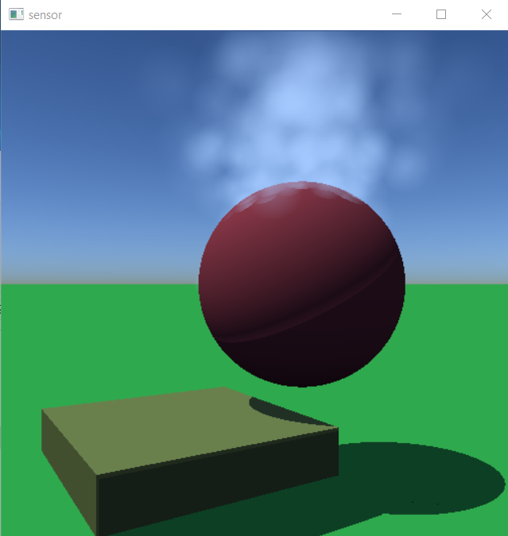

# Building MAVS From Source
MAVS can be built from source on both Windows and Linux/Unix systems.
 
(Jump to [building on Linux.](#building-mavs-on-linux))

(Jump to [building on Windows.](#building-mavs-on-windows))

## System Requirements
For all operating systems, you will need a [CMake](https://cmake.org/) version above 3.13.

You will also need [git](https://git-scm.com/download/). 

You will need a compiler that supports the CPP 17 standard (gcc 8 or higher or equivalent).

To run the python interface, you will also need to install [Python 3](https://www.python.org/downloads/release/python-370/). For Ubuntu users, you simply need to [install using apt](https://phoenixnap.com/kb/how-to-install-python-3-ubuntu). For Windows, you will also need to download and run the installer and add the folder containing the python.exe to your system path. 

## Cloning the MAVS repository
The steps for cloning MAVS are the same on both Windows and Linux/Unix. First clone the MAVS repo and name it "mavs". On Linux systems, it is recommended that you install MAVS in your home directory. 
```bash
cd ~
git clone --recursive https://github.com/CGoodin/msu-autonomous-vehicle-simulator.git mavs
```
MAVS has multiple dependencies configured as [git submodules](https://git-scm.com/book/en/v2/Git-Tools-Submodules), so you must include the --recursive command.

## Building MAVS on Linux
This section outlines how to build MAVS using terminal commands on Linux. Aptitude is the package manager used in the example commands for installing system dependencies. Users of different package managers will need to determine how to ensure the same dependencies are installed on their own. MAVS has been installed and tested on both Ubuntu and CentOS systems.

### System Dependencies
Ensure X11, libJPEG, and zlib development packages are installed. For example, on Ubuntu or Debian systems, execute the following:
```bash
sudo apt-get install libx11-dev libjpeg-dev zlib1g-dev
```
Older versions of distros may not have a sufficiently up-to-date cmake package. If cmake is not 3.13+, it will need to be updated as well. Doing so varies depending on distro but for Ubuntu, [Kitware's APT repository](https://apt.kitware.com/) is the recommended method. Navigate to that site and follow the steps for your version of Ubuntu.

### Installing MAVS on Linux
Presuming Embree and other system dependencies are now installed and available, MAVS can now be installed. To build MAVS in the default configuration, run the following from the repo's root directory:
```bash
cd ~/mavs
mkdir build
cd build
sudo ccmake ../
```
Use the ccmake tool to configure the MAVS build. Make sure to set the build type to "Release". Also ensure that the **DEFAULT_DATA_DIR** is set to point to your MAVS data folder. If you followed the steps above, then it should be set to *~/mavs/data*. 

It is reccomended that you set the **CMAKE_INSTALL_PREFIX** to */usr/local* if possible. If you install MAVS in a custom folder, you will need to set the CMAKE_PREFIX_PATH variable when linking other programs to MAVS using the *find_package* feature of CMake.

For a basic OpenMP-enable MAVS build, set the following options:
  * DEFAULT_DATA_DIR: ~/mavs/data
  * CMAKE_INSTALL_PREFIX: /usr/local
    * It is recommended that you install MAVS in your usr/local folder on Linux systems.
  * CMAKE_CONFIGURATION_TYPE: Release
  * Unless you wish to build Chrono, uncheck "MAVS_USE_CHRONO"
  * Unless you wish to use MAVS on a supercomputer, uncheck USE_MPI and make sure USE_OMP is checked.

You can then build MAVS with
```bash
$sudo make install
```

For running MAVS and linking MAVS to external applications, you may need to add the MAVS libraries to your system path. If MAVS was installed in */usr/local* as recommended above, this can be done by adding the following lines to your .bashrc file.
```bash
export LD_LIBRARY_PATH="$LD_LIBRARY_PATH:/usr/local/lib/"
export PATH="$PATH:/usr/local/lib"
```

## Building MAVS on Windows
This section discusses building Mavs on Windows. The [CMake GUI](https://cmake.org/download/) will be used to generate solutions for [Microsoft Visual Studio](https://www.visualstudio.com/downloads/). The zipped version of CMake's distributables can be run without installation with administrator privileges if necessary. When installing Visual Studio, make sure you select the C and C++ compilers for your installation.

If you wish to build the MPI version of the code (not recommended for desktop computers), you will also need to install the [Microsoft MPI compiler and SDK](https://www.microsoft.com/en-us/download/details.aspx?id=56727).

### Installing MAVS on Windows
Create a directory in the MAVS folder called `build` and another called `install`. Start the CMake GUI and perform the following steps:

* Select the MAVS repo as the source directory and the select `./mavs/build` as the build directory.
* Click the Configure button and select the appropriate version of Visual Studio to populate the initial CMakeCache. New options should appear highlighted in red.
* For a basic OpenMP-enable MAVS build, set the following options:
  * DEFAULT_DATA_DIR: `./mavs/data`
  * CMAKE_INSTALL_PREFIX: `./mavs/install`
    * It is recommended that you install MAVS in your mavs/install folder. Administrator privileges are needed to install MAVS to the default location in `Program Files`.
  * CMAKE_CONFIGURATION_TYPE: Release
  * Unless you wish to build Chrono, uncheck "MAVS_USE_CHRONO"
  * Unless you wish to use MAVS on a supercomputer, uncheck USE_MPI and make sure USE_OMP is checked.    
* Configure once more
* Click Generate to generate solutions
* Click Open Project to open the solutions in Visual Studio
* Build the INSTALL solution to build and install MAVS

**If you get build errors related to ReactPhysics3D (RP3D)**: In your CMake dialog box, uncheck "BUILD_SHARED_LIBS", reconfigure, and rebuild.

You may need to [add the library install location to your system path](./InstallingMavsBinaries.md) for MAVS to run correctly. This sometimes requires a restart of your computer.

To add a shortcut to the MAVS GUI to your Desktop, open the file browser and navigate to <MAVS_INSTALL_DIR>/bin. Right click on *mavs_gui* and select *Send to->Desktop (create shortcut)*.

## Testing the Build

To test if the build was successful, open a Windows command prompt and navigate to the MAVS build directory, then 
```bash
$ cd <MAVS_INSTALL_DIR>/bin
$ ./unit_tests/utest_mavs_camera
```
If successful, the output will be a camera rotating around a ball generating particle effects.



## Building MAVS with Optional Project Chrono Interface
[Project Chrono](https://projectchrono.org/) is a "physics-based modelling and simulation infrastructure based on a platform-independent open-source design implemented in C++."

MAVS can be compiled to automatically link to Chrono and integrate vehicle simulations from the Chrono-Vehicles module into MAVS. 

First, [clone and build Chrono](https://api.projectchrono.org/tutorial_table_of_content_install.html) on your system. The following options should be specified:

* CH_ENFORCE_CXX11 - True
* ENABLE_MODULE_VEHICLE - True
* CMAKE_CONFIGURATION_TYPES - Release

Note that on MSU computing clusters like Shadow and Orion, you made need to manually set the *EIGEN3_INCLUDE_DIR* to */apps/eigen-3.3.7/include/eigen3*.

Once Chrono is installed, reconfigure the MAVS build with CMake so that *MAVS_USE_CHRONO* is checked. Then configure the build

* CHRONO_DATA_PATH - /your/full/path/to/chrono/data
* Chrono_DIR - /your/full/path/to/chrono/build/cmake

With these options, MAVS should build and link to chrono. You can test this by running the *chrono_driving_example.py* in *mavs/src/mavs_python/examples*. Note that you will need to change line 4 of the example to give the path to your installation of MAVS.

Note that when building on Windows, you may get an error related to the Chrono file ChIdler.h. This can be fixed by editing lines 100-107 of ChIdler.h to look like this:
```cpp
/// Identifiers for the various hardpoints.
enum PointId {
    WHEEL,            ///< idler wheel location
    CARRIER,          ///< carrier location
    CARRIER_CHASSIS,  ///< carrier, connection to chassis (translational)
    TSDA_CARRIER,     ///< TSDA connection to carrier
    TSDA_CHASSIS
};
```

Finally, note that depending on where you install Chrono, you may need to add the path to your the Chrono shared libraries to your *PATH* variable on Windows or to your *PATH* and *LD_LIBRARY_PATH* on linux/unix.