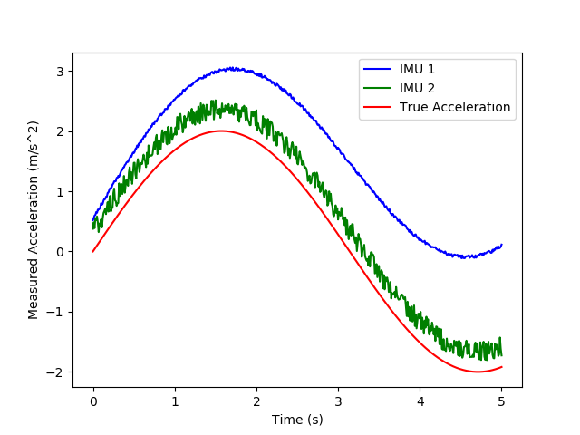

# MAVS Imu Model
The MAVS model for an Inertial Measurement Unit (IMU) is a class that contains three distinct inertial sensors - an accelerometer, a gyroscope, and a magnetometer. All three of these sensors are different variants of a MEMS sensor, and the noise model of these sensors is consistent between the three types of sensors.

The parameters of the three types of MEMS sensors are used similarly in the model but have different units. The base units of the gyroscope are radians/second. The base units of the accelerometer are m/s$^2$, and the base units of the magnetometer are microTesla ($\mu$T).

The parameters are further discussed in the following section. An example json input file is given below.

``` json
  "Sample Rate": 100.0,
  "Temperature": 25.0,
  "Magnetic Field": [27.5550, -2.4169, -16.0849],
  
  "Gyroscope":{
	"Measurement Range": 4.363,
	"Resolution": 1.332E-4,
	"Constant Bias": [0.349, 0.349, 0.349],
	"Noise Density": [8.727E-4, 8.727E-4, 8.727E-4],
	"Bias Instability": [0.0, 0.0, 0.0],
	"Axis Misalignment": [0.0, 0.0, 0.0],
	"Random Walk": [0.0, 0.0, 0.0],
	"Temperature Bias": [0.349, 0.349, 0.349],
	"Temperature Scale Factor": [0.02, 0.02, 0.02],
	"Acceleration Bias": [0.178E-3, 0.178E-3, 0.178E-3]
  },
  
  "Accelerometer":{
	"Measurement Range": 19.6,
	"Resolution": 0.598E-3,
	"Constant Bias": [0.49, 0.49, 0.49],
	"Noise Density": [3920.0E-6, 3920.0E-6, 3920.0E-6],
	"Bias Instability": [0.0, 0.0, 0.0],
	"Axis Misalignment": [0.0, 0.0, 0.0],
	"Random Walk": [0.0, 0.0, 0.0],
	"Temperature Bias": [0.294, 0.294, 0.294],
	"Temperature Scale Factor": [0.02, 0.02, 0.02]
  },
  
  "Magnetometer":{
	"Measurement Range": 1200.0,
	"Resolution": 0.1,
	"Constant Bias": [1.0, 1.0, 1.0],
	"Noise Density": [0.06, 0.06, 0.09],
	"Bias Instability": [0.0, 0.0, 0.0],
	"Axis Misalignment": [0.0, 0.0, 0.0],
	"Random Walk": [0.0, 0.0, 0.0],
	"Temperature Bias": [0.8, 0.8, 2.4],
	"Temperature Scale Factor": [0.1, 0.1, 0.1]
  }
```
- "Sample Rate": Sample rate of the sensor in Hz
- "Temperature": Temperature in degrees Celsius
- "Magnetic Field": Magnetic field of the scene in the East/North/Up coordinate system.
- "Gyroscope": Parameters have base units of rad/s
- "Accelerometer": Parameters have base units of m/s$^2$
- "Magnetometer": Parameters have base units of microTesla

## Mems Sensor Model Parameters
In the following list "units" refers to the base units of the accelerometer, gyroscope, or magnetometer.

- "Measurement Range": Maximum sensor reading (units)
- "Resolution": Resolution of sensor measurements (units/LSB)
- "Constant Bias": Constant sensor offset bias (units)
- "Noise Density": Power spectral density of the sensor noise (units/sqrt(Hz))
- "Bias Instability": Instability of the bias offset (units)
- "Axis Misalignment": Sensor axes skew (%)
- "Random Walk": Integrated white noise of sensor (units/sqrt(Hz))
- "Temperature Bias": Sensor bias from the temperature (units/Celsius)
- "Temperature Scale Factor": Scale factor error from the temperature (%/Celsius)
- "Acceleration Bias": For gyroscope only, sensor bias from linear acceleration (rad/s)/(m/s$^2$)

## Theory of the IMU Model
The IMU simulation in MAVS uses a generalized simulation of a micro elctro-mechanical system (MEMS), instantces of which can be used to simulated a three-axis gyroscope, three-axis linear accelerometer, or three-axis magnetometer. This implementation is similar to the method used in the [Matlab 2018b IMU simulation](https://www.mathworks.com/help/nav/ref/imusensor-system-object.html).

\section{MAVS IMU Model}
The MAVS model for an Inertial Measurement Unit (IMU) is a class that contains three distinct inertial sensors - an accelerometer, a gyroscope, and a magnetometer. All three of these sensors are different variants of a MEMS sensor, and the noise model of these sensors is consistent between the three types of sensors.

The parameters of the three types of MEMS sensors are used similarly in the model but have different units. The base units of the gyroscope are radians/second. The base units of the accelerometer are m/$s^2$, and the base units of the magnetometer are microTesla ($\mu$T).

### Model Parameters
The default units for each sensor type are different. The gyroscope has base units of rad/s, the accelerometer has base units of m/s$^2$, and the magnetometer has base units of microTesla ($\mu$T). The model parameters and their descriptions are shown in the following table.

| Parameter | Name | Notes | Units |
|-----------|------|-------|-------|
| $T$ | Ambient Temp. | | $^o$C |
| $\vec{B}$ | Magnetic Field | In local ENU | $\mu T$ |
| $\sigma$ | Sensor Sample Rate | | Hz |
| $\vec{\beta}_i$ | Bias Instability | | $u_s$  | 
| $\vec{\beta}_c$ | Constant Bias |  | $u_s$ | 
| $\vec{\beta}_t$ | Temperature Bias |  | $u_s$/$^o$C | 
| $\vec{n}_d$ | Noise Density | PSD of the sensor noise | $u_s$/$\sqrt{Hz}$ | 
| $\vec{\rho}_w$ | Random Walk | White noise of sensor | $u_s$/$\sqrt{Hz}$ | 
| $\vec{\alpha}_T$ | Temp. Scale Factor | Error scale with temp. | \%/$^o$C |
| $\vec{\delta}_r$ | Sensor Resolution |  | (units/LSB) |
| **$M$** | Axis Misalignment | Sensor axes skew  | \% |
| $\vec{R}_{max}$ | Measurement range | Maximum sensor reading  | $u_s$ |


The default sample rate is $\sigma=100.0$ Hz, the default temperature is $T=25.0^o$C, and the default magnetic field in ENU is $\vec{B}$=[27.5550, -2.4169, -16.0849] $\mu T$. For each sensor type, the default parameters are shown in the following table.

| Parameter | Accelerometer | Gyroscope | Magnetometer |
|-----------|---------------|-----------|--------------|
| $\vec{R}_{max}$ | 19.6 | 4.363  | 1200.0 |
| $\vec{\delta}_r$ | 0.598E-3 | 1.332E-4 | 0.1 |
| $\vec{\beta}_c$ | 0.49 | 0.349 | 1.0 | 
| $\vec{n}_d$ | 0.00392 | 8.727E-4 | [0.06, 0.06, 0.09] | 
| $\vec{\beta}_i$ | 0.0 | 0.0 | 0.0 | 
| **$M$** | 0.0 | 0.0  | 0.0 |
| $\vec{\beta}_t$ | 0.294 | 0.349 | [0.8, 0.8, 2.4] | 
| $\vec{\rho}_w$ | 0.0 | 0.0 | 0.0 | 
| $\vec{\alpha}_T$ | 0.02 | 0.02 | 0.1 |


### Model Equations
The inputs to the model are the ``true'' values of the measurements to be simulated. For an accelerometer, this will be the true 3-axis acceleration in m/s$^2$. For a gyroscope, this will be the true 3-axis angular acceleration in rad/s, and for the magnetometer, this will be the true Eueler angles (radians) about the x, y, and z axes in the ENU coordinate system. For all three cases, if the inputs are defined as $\vec{a}_{in}$ then the gain is given by

$$\vec{b} = M\vec{a}_{in} + \vec{\beta}_c$$

where $\vec{beta}_c$ is the constant bias and **$M$** is the axis misalignment matrix. The bias instability error is calculated using a random number generator.

$$\vec{\beta}_1 = w\vec{\beta}_i$$

where $w$ is a random number in the range [-1.0:1.0].

This is filtered by 

$$\vec{\beta_1} = \mathscr{F}_1(\vec{\beta_1})$$

where $\mathscr{F}_1$ is a filter given by the function

$$\mathscr{F}_1(x) =  1.0 / (1.0 + ((2.0/\sigma)-1.0)*(1.0 / x))$$

where $\sigma$ is the sample rate of the sensor. 

The white noise error is given by 

$$\vec{\beta}_2 = w\sqrt{\sigma/2}n_d$$

where $n_d$ is the noise density. The random walk error is given by 

$$\beta_3 = \rho_w w/\sqrt{\sigma/2}$$

where $\rho_w$ is the random walk parameter for the sensor. This error is filtered by 

$$\beta_3 = \mathscr{F}_2(\beta_3)$$

where $\mathscr{F}_2$ is a filter given by the function

$$\mathscr{F}_2(x) =  1.0 / (1.0 - (1.0 / x))$$


The thermal error is given by 

$$\delta_e = (T-25.0)\beta_t$$

where $T$ is the current temperature in $^o$C and $\beta_t$ is the temperature bias of the sensor. 

The total error is then given by summing the error from the error equations above.

$$\vec{c} = \vec{\beta}_1+\vec{\beta}_2+\vec{\beta}_3 + \vec{\delta_e}+\vec{b}$$

The total error is scaled by the temperature bias according to the equation

$$\vec{d} = c\circ\delta_{sf}$$

where $\circ$ represents element-wise multiplication and $\delta_{sf}$ is the temperature bias scale factor given by 

$$\vec{\delta}_{sf} = \vec{1}+\frac{T-25.0}{100.0}\alpha_T$$

Finally, the output is discretized according to the sensor resolution $\delta_r$ and the measurement range $R$ by the equation.

$$\vec{a}_{out} = \delta_r \text{round}\big(\frac{\min(\max(\vec{d},-R),R)}{\delta_r}\big)$$

where $\vec{a}_{out}$ is the return value of the simulation step. The implementation of this model in MAVS is shown in the C++ code below.

### Test Case
As a point of comparison, an example simulation was run with two different IMU sensors. Sensor 1 had the default parameters, while sensor 2 had the following parameters changed.

* $n_d = 0.025$
* $\beta_i = 0.01$
* $\beta_t = 0.0$
* $\beta_c = 0.0$


The input acceleration was only in the direction as varied as $a_x=2\sin(t)$ where $t$ was the elapsed simulation time in seconds. The temperature increased over the course of the simulation as well $T=25+t$. The results of the simulation are shown in the following figure. The Python code used in the simulation is given in the example below.



This Figure shows how adjusting the different error parameters affects the signal. Specifically, in IMU 2, the temperature dependent error and constant bias offset were turned down, while the white-noise error parameters were increased, resulting in a noisier signal with less offset.


### Implementation

Implementation of the MEMS accelerometer / gyro / magnetometer model in MAVS.
```c++
glm::vec3 MemsSensor::Update(glm::vec3 input, 
                             float temperature, 
                             float sample_rate) {

  glm::vec3 output(0.0f, 0.0f, 0.0f);
	
  glm::vec3 b = alignment_matrix_ * input + constant_bias_;

  float w1 = ((float)rand() / (RAND_MAX)) + 1; //0 to 1
  float w = 2.0f*(w1 - 0.5f); //-1 to 1

  glm::vec3 beta1 = w * bias_instability_;
  for (int i = 0; i < 3; i++) {
    beta1[i] = Filter1(beta1[i], sample_rate);
  }

  glm::vec3 beta2 = (w*(float)sqrt(0.5f*sample_rate))*noise_density_;

  glm::vec3 beta3 = (float)(w / sqrt(0.5f*sample_rate))*random_walk_;
  for (int i = 0; i < 3; i++) {
    beta3[i] = Filter2(beta3[i]);
  }
  glm::vec3 env_noise = (temperature - 25.0f)*temperature_bias_;

  glm::vec3 c = beta1 + beta2 + beta3 + env_noise + b;

  glm::vec3 one(1.0f, 1.0f, 1.0f);
	float temp_coeff = ((temperature - 25.0f) / 100.0f);
  glm::vec3 scale_factor_error = one + 
	                               temp_coeff*temperature_scale_factor_;
  
  // element-wise multiplication
  glm::vec3 d = c*scale_factor_error;

  glm::vec3 e;
  for (int i = 0; i < 3; i++) {
    e[i] = std::max(std::min(measurement_range_, d[i]), 
                    -measurement_range_);
    output[i] = resolution_ * round(e[i] / resolution_);
  }
  return output;
}
```

### MAVS Python IMU Example
```python
import sys
import matplotlib.pyplot as plt
import math
# Set the path to the mavs python api, mavs_interface.py
# You will have to change this on your system.
sys.path.append(r'C:\path\to\mavs\src\mavs_python')
# Load the mavs python modules
import mavs_interface as mavs

imu1 = mavs.MavsMems('accelerometer')
imu2 = mavs.MavsMems('accelerometer')
imu2.SetNoiseDensity(0.025)
imu2.SetBiasInstability(0.01)
imu2.SetTemperatureBias(0.0)
imu2.SetConstantBias(0.0)

temperature = 25.0
x1_accel = []
x2_accel = []
x_true = []
time = []
dt = 0.01
elapsed_t = 0.0
while elapsed_t<5.0:
    accel_in = [2.0*math.sin(elapsed_t), 0.0, 0.0]
    accel_out1 = imu1.Update(accel_in,temperature,1.0/dt)
    accel_out2 = imu2.Update(accel_in,temperature,1.0/dt)
    x1_accel.append(accel_out1[0])
    x2_accel.append(accel_out2[0])
    x_true.append(accel_in[0])
    time.append(elapsed_t)
    elapsed_t = elapsed_t + dt
    temperature = temperature + dt

plt.plot(time, x1_accel, 'b-', label='IMU 1')
plt.plot(time, x2_accel, 'g-', label='IMU 2')
plt.plot(time,x_true,'r-', label='True Acceleration')
plt.xlabel('Time (s)')
plt.ylabel('Measured Acceleration (m/s^2)')
plt.legend()
plt.savefig('imu_compare.png')
plt.show()
```