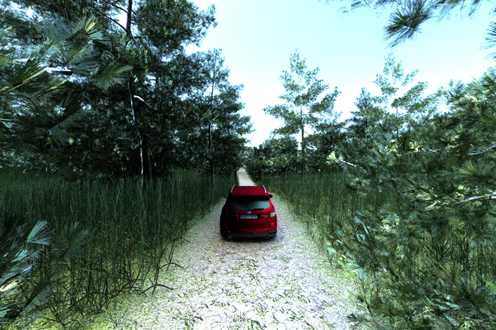

# MAVS Path Tracer
MAVS can be used to generate photorealistic images of existing MAVS scenes. Photorealism is achieved with path-tracing \cite{jensen1995importance}. Path-tracing uses hundreds or thousands of rays per pixel, resulting in high-quality images, but also making the rendering time much slower than single-pass ray-tracing. Therefore, the path-tracer should only be used in applications where image quality is a higher priority than simulation speed.



The path tracer can be accessed through the utilities installation.
```
$./full_path_to/path-tracer_render /full/path/to/scene/file spp rd rc sky
```
where the arguments are
* spp - The number of samples per pixel
* rd - The maximum ray depth
* rc - The ray cutoff, from 0-1
* sky - 0 for sky off, 1 for sky on.

Additionally, the path tracer can be accessed through the python interface. A path-tracing camera can be created in a manner similar to other cameras in MAVS using the ``model'' function.
``` python
# 1080P HD-Camera
hd_cam = mavs.MavsCamera()
hd_cam.Model('HDPathTraced')

# Half-resolution HD-Camera
half_hd_cam = mavs.MavsCamera()
half_hd_cam.Model('HalfHDPathTraced')

# 224x224 machine vision camera
machinevision_cam = mavs.MavsCamera()
machinevision_cam.Model('MachineVisionPathTraced')
```

Alternatively, a path-traced camera can be created in which the number of rays-per-pixel and maximum pixel depth are specified.
``` python
res = 'medium' #options are 'low', 'medium', or 'high'
rpp = 250 # rays per pixel
pix_depth = 15 # max ray depth
piccut = 0.55 # must be 0-1
hd_cam = mavs.MavsPathTraceCamera(res,rpp,pixdepth,pixcut)
```

Once the camera is created, it can be used to render a scene in the same way as an ordinary camera (Section \ref{sec:camera}). 
```
hd_cam.SetPose([0.0, 0.0, 1.5],p[1.0, 0.0, 0.0, 0.0])
hd_cam.Update(env,0.03)
hd_cam.SaveCameraImage('path_traced_image.bmp')
```

Note that many of the features enabled in the default MAVS camera such as snow, rain, and dust are not enabled with the path-tracing camera.