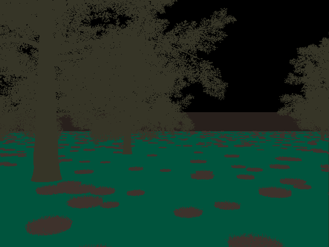
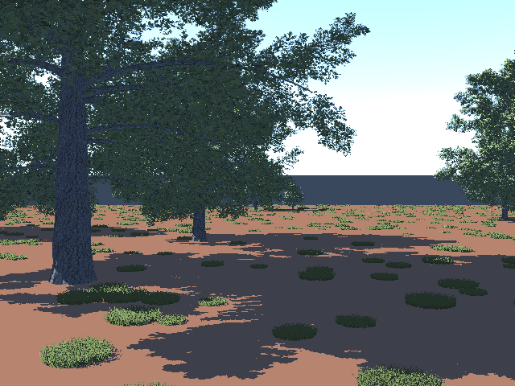
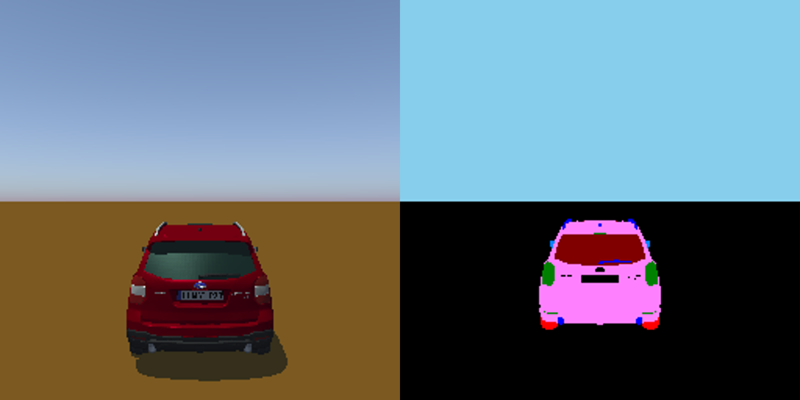

# MAVS Sensor Annotations
MAVS can automatically segment and annotate the raw sensor data created during a simulation. 

To add annotations to a sensor in a [MAVS Autonomy or Sensor Simulation](../MavsSimulationInputsFiles.md), simply check the *Draw Annotations* box in the sensor dialog box that can be accessed by clicking *Edit Sensor*.

Automated image annotation is currently accessible through the C++ API via the AnnotateFrame, SaveSegmentedImage, and SaveSemanticAnnotationsCsv methods of the camera class. More details of these methods can be found in the API documentation.

In order to perform labeling on a scene, the [scene definition file](../MavsSimulationInputsFiles.md) must list a label file corresponding to the objects in that scene.

*scenefile.json*:
``` json
"Object Labels": "labels.json",
```

## Object Labeling
In order to perform semantic labeling, each object included in the scene must be assigned semantic label. The json file listing the semantic labels should be included in the same directory as the meshes (.obj files). An example semantic label file is given below. The label definitions are listed in the "Label Colors" block, followed by a list of obj files and their corresponding label definitions.

*labels.json*:
``` json
{
  "Label Colors": [
    {
      "Label": "obstacle",
      "Color": [ 1.0, 0.0, 0.0 ],
      "Label Number": 3
    },
    {
      "Label": "tree",
      "Color": [ 0.0, 0.5020, 0.0 ],
      "Label Number": 2
    },
    {
      "Label": "vegetation",
      "Color": [ 0.5020, 0.0, 0.0 ],
      "Label Number": 1
    },
    {
      "Label": "ground",
      "Color": [ 0.0, 0.0, 0.0 ],
      "Label Number": 0
    },
    {
      "Label": "vehicle",
      "Color": [ 0.0, 0.0, 1.0 ],
      "Label Number": 4
    }
  ],

"Labels": [
	[ "textured_surface", "ground" ],
	["checkerboard.obj", "obstacle"],  
	["GC08_1.obj", "grass"],    
	["grass_blade_10mm.obj", "tree"],  
	["RoadBlockade_01.obj", "obstacle"],
	["CL13y.obj", "tree"],
	["Grass_01.obj", "grass"],
	["grass_blade_20mm.obj", "grass"],
	["RoadBlockade_02.obj", "obstacle"],
	["cube.obj", "surface"],
	["Grass_02.obj", "grass"],
	["grass_blade_30mm.obj", "grass"],  
	["Tree_V9_Final.obj", "tree"],
	["cylinder.obj", "obstacle"],
	["Grass_03.obj", "grass"],
	["hmmwv.obj", "vehicle"],
	["wall.obj", "obstacle"]
	]
}
``` 

In this example, the available semantic labels are *grass*, *tree*, *obstacle*, *vehicle*, and *ground*. In practice, the user can define any desired set of semantic labels. An example output sematically labeled image is shown below, along with the unlabeled original.



The automatic annotation process also generates a CSV file that links the labeled image colors to the label names.
``` csv
Name, Red, Green, Blue
surface, 23, 54, 32
tree, 54, 53, 39
grass, 62, 50, 44
obstacle, 40, 32, 28
```

Also of note is that the object name *textured_surface* has special significance in MAVS and is used to designate any procedurally generated surface.

## Group Labeling
Individual groups within an obj file can also be labeled. To label an object by group, the mesh definition block in the json scene file must include the field "Label By Group" and set the value to true.

*scenefile.json*:
``` json
{ 
	"Mesh": "forester_vehicle_m_rot.obj",
	"Rotate Y to Z": false,
	"Label By Group": true,
	"Instances":[
	{"YawPitchRoll":[0,0,0],
		"Position": [0,0,0.3],
		"Scale": [1.0, 1.0, 1.0]
	}
	]
}
```
In the coressponding label definition file, each named group of the mesh needs to be assigned a label, see below.

*group_labels.json*: 
``` json
{
  "Label Colors": [
    {
      "Label": "wheel",
      "Color": [ 1.0, 0.0, 0.0 ],
      "Label Number": 3
    },
    {
      "Label": "light",
      "Color": [ 0.0, 0.5020, 0.0 ],
      "Label Number": 2
    },
    {
      "Label": "window",
      "Color": [ 0.5020, 0.0, 0.0 ],
      "Label Number": 1
    },
    {
      "Label": "interior",
      "Color": [ 0.0, 0.0, 0.0 ],
      "Label Number": 0
    },
    {
      "Label": "detail",
      "Color": [ 0.0, 0.0, 1.0 ],
      "Label Number": 4
    },
	{
      "Label": "mirror",
      "Color": [ 0.0, 0.502, 1.0 ],
      "Label Number": 5
    },
	{
      "Label": "body",
      "Color": [ 1.0, 0.502, 1.0 ],
      "Label Number": 6
    },
	{
      "Label": "logo",
      "Color": [ 1.0, 0.502, 0.0 ],
      "Label Number": 7
    },
	{
      "Label": "ground",
      "Color": [ 0.0, 0.0, 0.0 ],
      "Label Number": 8
    }
  ],

"Labels": [
	["light_front_down_lamp","light"],
	.
	.
	.
	["window_edge","window"],
	.
	.
	.
	["wiper_front_right","detail"],
	.
	.
	.
	["side_backward_mirror_body","mirror"],
	.
	.
	.
	["logo_rear_AWD_text","logo"],	
	.
	.
	.
	["body_parts_bumper_detail","body"],	
	.
	.
	.
	["wheel_front_left_caliper_brakedisk","wheel"],
	.
	.
	.
	[ "textured_surface", "ground" ]
  ]
}
```
This group labeling produces the following labeled image for this Subaru Forester model.
