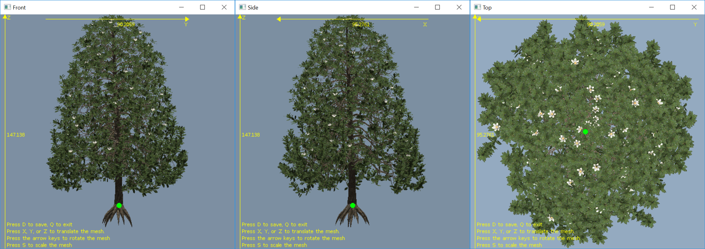

# MAVS .obj Viewer Utility
The MAVS obj viewer is an interactive utility application for viewing, scaling, translating, and rotating wavefront .obj files. The utility can be used to put objects in the default [MAVS coordinate system](../Environment/MavsCoordinateSystem.md).

The utility is run from the command line by typing
``` shell
> ./mavs/build/bin/utilities/obj_viewer
```

When the program starts, the user will be prompted to load a Wavefront .obj file using a file dialog. Once the file is loaded, three windows will appear, providing a front, side, and top view of the object, along with its dimensions.


The X-Y-Z dimensions are displayed along the yellow axes in each window. The green dot shows where the (0,0,0) coordinate is relative to the mesh. Note that if (0,0,0) falls outside the rendered view area, the coordinate will not be displayed.

Instructions for modifying the mesh are displayed in the bottom left corner of the screen. These commands can be typed when any of the three windows is active (on top).

|Key|Function|
|------|------|
| X | Translate mesh along the x-axis |
| Y | Translate mesh along the y-axis |
| Z | Translate mesh along the z-axis |
| S | Scale the mesh |
| ? | Rotate the mesh 90 about the X-axis|
| ? | Rotate the mesh -90 about the X-axis|
| ? | Rotate the mesh 90 about the Z-axis|
| ? | Rotate the mesh -90 about the Z-axis|
| D | Save the current mesh to a new file and quit| 
| Q | Quit without saving |

Note that when pressing the X, Y, Z, or S key to translate or scale the mesh, the user will be prompted to input a value for the scale or translation. When rotating the mesh with the arrow keys, all rotations are 90 degrees, so pressing any arrow key four consecutive times will return the mesh to its original state. Any 90 degree rotation can be achieved using different combinations of rotations with the arrow keys.

When pressing **D** to save the mesh, the user will be prompted to select an output file with a file dialog box. Press **Q** to exit the program without saving the modified mesh.