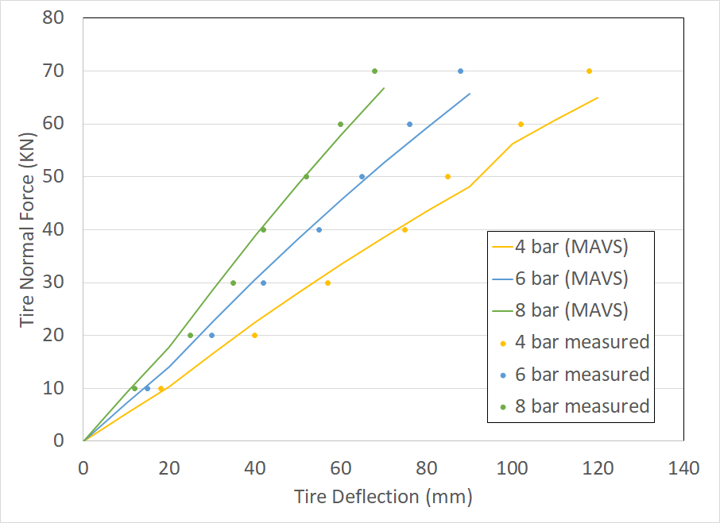

# MAVS Radial Tire Model
MAVS uses a radial-spring tire model to calculate the normal force on the tire caused by interaction with rough terrain. The radial spring tire model is not used to calculate the lateral and longitudinal friction, which are handled by the [VTI model](./mavs_vti.md). Rather, the spring tire model is only used to calculate the normal force, taking into account terrain geometry and tire deflection. This is used as input to the VTI model.

The tire model in MAVS is based on the 1975 paper by D.C. Davis, [*A radial-spring terrain-enveloping tire model*](https://www.tandfonline.com/doi/pdf/10.1080/00423117508968461?casa_token=v2QowT2yYdkAAAAA:y_swIl78VxuMsWzyKIOFTkg73Mw4wBgzaTg-dFi1_p7pof_sPxH2C357gfqxm0B7_UAjXP7_XOg-tJE). In that work, the concept of *equivalent deflection* is introduced. For an irregular terrain profile and tire position, the overlapping area between the terrain and tire is equated to the area that would produce the same deflection on a flat surface. This equivalent deflection is used to calculate the normal force. 

In the MAVS radial-spring tire model, the overlapping area is converted to an overlapping volume, which is in turn used to calculate an equivalent deflection. This equivalent deflection is then used as a driver to a linear spring-damper system representing the dynamic state of the tire.

| Symbol	|	Description	|	Units	|
|-----------|---------------|-----------|
| $r_u$ | Undeflected radius of the tire | m |
| $k$ | Tire spring constant | Pascals |
| $w$ | Tire width | m |
| $R$ | Tire orentation matrix | - |
| $p$ | Tire position | Global ENU |
| $d\theta$ | Resolution of the tire angular sampling | radians |
| $d_{slice}$ | Resolution of the tire lateral sampling | m |
| $N_{s}$ | Number of lateral elements (slices) | m |
| $N_{d}$ | Total number of deflected elements | m |
| $d_e$ | Equivalent deflection | m |
| $\delta_{ij}$ | Deflection of spring element (i,j) | m |

## Calculating the Equivalent Deflection
The tire is divided into lateral slices, and each slice is divided radially into segments with angular resolution of $d\theta$. While the original paper by Davis uses an interpolation method to determine the intersection point of each radial segment with the terrain, in MAVS, ray-tracing is used. If the distance to the intersection point with the terrain is $t$, then if $t<r_u$, then the deflection is given by $\delta_{ij}=r_u-t$. Otherwise, $\delta_{ij}=0$.

For a given slice, $j$, the angle covered by the contact patch is given by summing over all the deflected elements in the slice.

$$\Theta_j = \sum\limits_{i=1}^{N_{d}} d\theta$$

The total contact length is found by averaging over all the slices.

$$\Theta = \frac{\sum\limits_{j=1}^{N_{s}} \Theta_j}{N_{s}} $$

The 2D area displaced by a given slice is 

$$a_j = \sum\limits_{i=1}^{N_{d}} (r\delta_{ij}-\frac{\delta_{ij}^2}{2})d\theta$$ 

The volume of the deflected slice is then given by 

$$v_j = \frac{a_j w}{N_s}$$

The total deflected volume is then

$$v_t =  \sum\limits_{j=1}^{N_{s}} v_j$$

For a contact arc $\Theta$ on a rigid, flat, planar surface, the nominal deflection is given by

$$d_{max} = r_u(1-\cos\Theta/2)  $$

and the total displaced area of the slice is 

$$a_s = r_u^2(\Theta-\sin\Theta)/2 $$

The total displaced volume is 

$$v_s = w a_s$$

Therefore, using the rule of proportionality, the equivalent displaced volume of the radial spring tire is

$$d_e = v_t d_{max}/v_s $$

## Dynamic Force Model
Using the equivalent deflection calcuated in the previous step, the dynamic, time dependent normal force exerted by the tire is given by a linear spring-damper model

$$F_n = k d_e - c v $$

where $F_n$ is the normal force in Newtons, $k$ is the spring constant of the tire, $d_e$ is the equivalent deflection of the tire, $v$ is the velocity, and $c$ is the damping constant of the tire.

## Validation
In order to validate the MAVS radial spring tire model, we compare to publish data on load versus deflection for a specific tire. The relevant tire parameters used in this analysis are shown in the following table.

| Parameter	| Value	|	
|-------------------------|---------|
| Tire Undeflected Radius | 0.565 m |
| Tire Width | 0.309 m |
| Number of Slices | 3 |
| Angular Resolution | 2.5$^o$ |


In the work by [Raghem 2013], the force versus deflection relationship is plotted for the tire at three inflation pressures. In the following table, the spring rates used to model the tires in MAVS are shown next to the inflation pressures from the reference

| Inflation Pressure (Pascals) | Spring Constant (MAVS) |
|------------------------------|------------------------|
| 400000 | 550000 |
| 600000 | 750000 |
| 800000 | 950000 |

With these parameters, the results from the MAVS simulation are compared to the force versus deflection relationship from [Raghem 2013].



Based on this figure, the implementation of the MAVS radial spring tire model is valid for accurately predicting the normal force of a deflected tire under load. We find that the MAVS spring constant necessary to reproduce the experimental results is equal to the inflation pressure plus a constant offset of 150000 Pascal, or about 22 PSI. This may be interpreted as the support caused by the tire sidewalls.

## MAVS Implementation
For reference purposes, this appendix contains the code as it is implemented in MAVS. This update function is called at each time step. The data for this comparison come from [Multi-Wheeled Combat Vehicle Tire Modeling on Rigid and Soft Terrain by Raghem, El-Gindy, and Kishawy in 2013](http://gvsets.ndia-mich.org/documents/MSTV/2013/Multi-Wheeled%20Combat%20Vehicle%20Modeling%20on%20Rigid%20and%20Soft%20Terrain.pdf).

```c++
float Tire::GetNormalForce(environment::Environment *env) {
  // loop through and put the slices in the right position
  glm::vec3 look_side = orientation_[1];
  for (int j = 0; j<slices_.size(); j++) {
    slices_[j].position = tire_position_ + slices_[j].offset*look_side;
  }

  // in this loop, calculate the deflections at each sample point
  // this is different that Equation 1 of DAVIS because it uses raytracing
  float ncontact = 0.0f;
#pragma omp parallel for reduction(+: ncontact) schedule(dynamic)
  for (int j = 0; j<nslices_; j++) {
    for (int i = 0; i<nsprings_; i++) {
      slices_[j].springs[i].SetDeflection(0.0f);
      glm::vec3 dir = orientation_ * slices_[j].springs[i].GetDirection();
      if (dir.z<0.0f) {
        glm::vec3 pos = slices_[j].position;
        raytracer::Intersection inter = env->GetClosestTerrainIntersection(pos, dir);
        float r = inter.dist;
        if (r > 0.0f && r < undeflected_radius_) {
          ncontact += 1.0f;
          slices_[j].springs[i].SetDeflection(undeflected_radius_ - r);
        }
      }
      slices_[j].springs[i].SetPosition(slices_[j].position + slices_[j].springs[i].GetDirection()*(undeflected_radius_ - slices_[j].springs[i].GetDeflection()));
    }
  }
  // check if tire is not touching
  if (ncontact == 0)return 0.0f;
  // DAVIS, Equations 2, 4, and 5
  float theta_contact = ncontact * dtheta_ / nslices_;
  float d_max = undeflected_radius_ * (1.0f - cos(0.5f*theta_contact));
  float a_s = 0.5*undeflected_radius_*undeflected_radius_*(theta_contact - sin(theta_contact));
  float v_s = section_width_ * a_s;

  // in the this loop, calculate the deflected volume
  float v_t = 0.0f;
#pragma omp parallel for reduction(+: v_t) schedule(dynamic)
  for (int j = 0; j<slices_.size(); j++) {
    for (int i = 0; i<nsprings_; i++) {
      float di = slices_[j].springs[i].GetDeflection();
      // DAVIS Equation 3
      float displaced_area = (undeflected_radius_*di - 0.5f*di*di)*dtheta_;
      v_t += displaced_area * dslice_;
    }
  }

  // DAVIS Equation 6, equivalent deflection
  float d_e = d_max * v_t / v_s;
  current_equivalent_deflection_ = d_e;
  // DAVIS Equation 17
  float fn = spring_constant_ * d_e; // *d_e;
  return fn;
}
```
