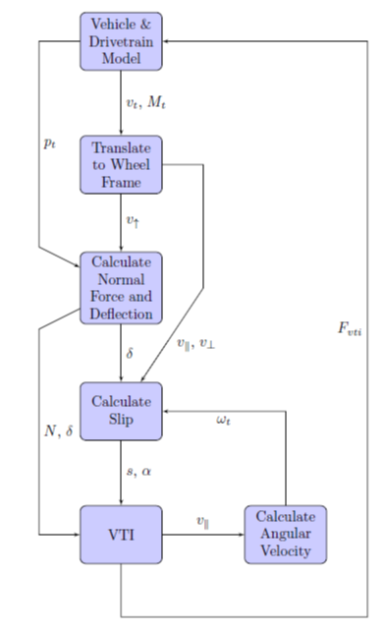

# MAVS VTI Model
The Mississippi State University Autonomous Vehicle Simulator (MAVS) incorporates multiple vehicle-terrain interface (VTI) equations to simulate tire-terrain interaction on various surface types including sand, clay, dry and wet pavement, snow, and ice. The MAVS vehicle simulation has several unique features which will be highlighted in this work. First, it is *dynamic*, meaning that the simulation updates at discrete time intervals, $dt$, during which aspects of the tire-soil interaction such as the tire deflection, angular velocity, slip, and load will change. Second, the VTI works on rough, uneven terrain, meaning the load and resulting VTI must be calculated individually for each tire at every time step. Finally, the MAVS vehicle simulation is modular, meaning the tire model and the vehicle-terrain interaction model are separable. This implementation is similar to the one in the CREATE-GV Mercury software [\[Goodin 2017\]](https://www.sae.org/publications/technical-papers/content/2017-01-0273/). The symbols used in this work are shown in the table below.

| Symbol	|	Description	|	Units	|
|-----------|---------------|-----------|
| $M_t$ | Orientation matrix of the wheel | Global coordinates |
| $\vec{LT}$, $\vec{LS}$, $\vec{LU}$ | Orthogonal basis vectors in wheel frame | - |
| $Q$ | Torque applied to the wheel | Nm |
| $N$ | Normal force exerted on the tire by the ground | N |
| $\omega_t$ | Angular velocity of the tire | rad/s |
| $\delta$ | Deflection of the tire | m|
| $s$ | Tire longitudinal slip | - |
| $\alpha$ | Tire slip angle / lateral slip | radians |
| $dt$ | Time step size for the tire update | seconds |
| $I_t$ | Tire moment of inertia | |
| $\vec{v}_t$ | Linear velocity of the tire | Global m/s |
| $\vec{v}_{\parallel}$, $\vec{v}_{\bot}$, $\vec{v}_{\uparrow}$ | Components of linear velocity of the tire | Tire frame m/s |
| $\vec{p}_t$ | Position of the tire | Global ENU m |
| $Z(x,y)$ | Terrain height function | Global m |
| $d$ | Tire diameter | m |
| $r_{eff}$ | Effective radius of the tire | m |
| $F^{vti}$ | Net traction forces on the tire | N |
| $\beta$ | Tire viscous friction coefficient | - |
| $h$ | Tire section height | m |
| $b$ | Tire section width | b |

## Steps in the VTI Calculation
MAVS uses a rigid-body multibody dynamics (MBD) model to simulated the vehicle. In the MBD implementation, elements can be manipulated by applying forces and torques. Dynamic state variables like position, orientaiton, and velocity are then calculated by the MBD code. VTI forces are applied at the hub of each wheel, and each wheel is connected to the sprung mass (chassis) by a slider joint with a linear spring-damper system. The forces applied at the hub come from the tire and VTI model. The following subsections detail the sequence of the VTI calculation in MAVS. A basic overview of the MAVS tire/terrain update step is outlined below in the figure below.


### Step 1: Translate wheel velocities from the global to tire frame
The vehicle model provides the tire velocity in global coordinates ($\vec{v}_t$) and the tire orientation matrix, ($M_t$) in global coordinates. The look-to, look-side, and look-up vectors ($\vec{LT}$, $\vec{LS}$, and $\vec{LU}$) defining the three principal directions of the tire can be extracted from the rotation matrix. The longitudinal velocity of the tire is then

$$v_{\parallel}(t)= \vec{v}_t(t)\cdot\vec{LT}(t)$$

while the lateral velocity is

$$v_{\bot}(t) = \vec{v}_t(t)\cdot\vec{LS}(t)$$

where $\vec{LS}$ is the side-looking vector that points toward the passenger side of the vehicle. Finally, the velocity in the vertical direction is given by

$$v_{\uparrow}(t) = \vec{v}_t(t)\cdot\vec{LU}(t)$$

where $\vec{LU}$ is the ``Look Up'' vector of the wheel. These vectors form a new basis for the tire velocity in the tire frame such that

$$\vec{v}_t(t) = v_{\parallel}(t)\vec{LT}(t)+v_{\bot}(t)\vec{LS}(t)+v_{\uparrow}(t)\vec{LU}(t)$$

### Step 2: Calculate the normal force based on the local terrain height
At each time step, the tire deflection, $\delta(t)$, is calculated using the current tire position $\vec{p}_t(t)=[p_x,p_y,p_z]$, local terrain height $Z(x,y)$, and the tire diameter. 

$$\delta(t) = Z(p_x,p_y)+\frac{d}{2}-p_z$$

The normal force $N(t)$ is then calculated using a linear spring-damper model from the tire deflection and velocity.

$$N(t) = k\delta(t)-cv_{\uparrow}(t)$$

where $k$ and $c$ are the tire spring and damping coefficients, respectively.

### Step 3: Calculate slip and slip-angle
The effective wheel radius $r_{eff}(t)$ is calculated from the diameter ($d$) and the deflection $\delta(t)$.

$$r_{eff}(t) = \frac{d}{2} - \delta(t)$$

The tire slip is then calculated from the tire longitudinal velocity and angular velocity. The slip is given by the following equation

$$s(t)=\begin{cases}
\frac{r\omega_t}{v_{\parallel}} - 1 & \text{$v_{\parallel} < r\omega_t$ and $v_{\parallel}\neq0$}\\
1- \frac{v_{\parallel}}{r\omega_t} & \text{$v_{\parallel} > r\omega_t$ and $r\omega_t\neq0$} \\
0 & \text{otherwise}
\end{cases}$$

The slip angle, $\alpha(t)$ is given by

$$\alpha = \tan^{-1}\frac{v_{\bot}(t)}{|v_{\parallel}(t)| }-\theta(t)$$

where $\theta(t)$ is the current steering angle of the tire.

### Step 4: Calculate VTI Forces
The force exerted by the terrain on the tire is calculated from the VTI. In MAVS, the VTI equation must have the form

$$F^{vti} = [F^{vti}_{\parallel},F^{vti}_{\bot}] =  f(N,\delta,s,\alpha)$$

The inputs are the normal force, tire deflection, tire slip, and tire slip angle calculated in the previous steps.

### Step 5: Update Wheel Angular Velocity
The wheel and the VTI are treated as separate physical systems in MAVS. After the VTI forces are updated, the wheel angular velocity is calculated at each time step according to the equation

$$\omega_t(t+\delta t) = \omega_t(t) + \frac{dt}{I_t}(Q(t)-\frac{d}{2}F_{\parallel}(t)-\beta\omega_t(t))$$

where $\beta$ is the viscous friction coefficient of the tire, $Q(t)$ is the applied torque from the driveline, $I_t$ is the moment of inertia of the tire, and $F_{\parallel}$ is the longitudinal net traction calculated from the VTI. The angular velocity calculated at this time step will be used in the following time step to calculate the wheel slip.

### Step 6: Transform forces into global frame and apply to vehicle
The 3D force applied to the wheel hub, in global coordinates, is given by

$$F_{\text{global}} = F^{vti}_{\parallel}\vec{LT} + F^{vti}_{\bot}\vec{LS} + N\vec{LU}$$

 This force is applied when the tire/VTI model finishes. The vehicle and driveline models then perform their update steps and re-initiate the tire model with updated tire position, velocity, angular velocity, and applied torque.

## MAVS VTI models

This section presents the VTI models that are currently implemented in MAVS. Each of these models is a an implementation of the basic VTI equation for a different terrain type. 

### Dry and Wet Pavement, Snow and Ice
Dry and wet pavement, snow, and ice are modeled in MAVS using the Pacejka Magic Formula [\[Short 2004\]](https://www.researchgate.net/profile/Michael_Short5/publication/329588123_Simulation_of_Vehicle_Longitudinal_Dynamics/links/5c111d21a6fdcc494feec991/Simulation-of-Vehicle-Longitudinal-Dynamics.pdf).

$$F^{vti}_{\parallel}(s) = D\sin(C\tan^{-1}(Bs-E(Bs-\tan^{-1}(Bs))))$$

The coefficients for this equation vary based on the surface condition. The different coefficients used in MAVS are shown in the following table.

| Surface | B | C | D | E |
|---------|---|---|---|---|
| Dry | 10.0 | 1.9 | 1.0 | 0.97 | 
| Wet | 12.0 | 2.3 | 0.82 | 1.0 | 
| Snow | 5.0 | 2.0 | 0.3 | 1.0 | 
| Ice | 10.0 | 2.0 | 0.1 | 1.0 | 


### Coarse-grained Soil
The VTI numeric for coarse-grained soil (sand) is [\[Mason 2018\]](https://www.sciencedirect.com/science/article/pii/S0022489817301167?casa_token=cgtI3UEeOe8AAAAA:elBxhBiqd5q7HoUBd6hIzKZn3Xe8KUnZe4CrLR9vIb97RCbZFTju1hWqLJ7w6I_g4SbGUZJnZtcp)

$$N_s = \frac{G(bd)^\frac{3}{2}\delta}{Nh}$$

where $G$ is related to the cone index by $G=CI/3.47$ [\[Mason 2016\]](https://www.sciencedirect.com/science/article/pii/S0022489816300271?casa_token=K8T5JQe7xoYAAAAA:iCT0sQYg6cRbfJI5Oir7qJyhp7-mqTaESEHd6rwNQT6yp0LzYow1crUUGYEA1wvVIyI0YEdplV4). The gross traction coefficient is given by

$$T_{sand}(s) = X - \frac{XY}{N_s+10+Y}$$

where $X=0.66$ and $Y=4.71 + 1.72/s$ [\[Mason 2018\]](https://www.sciencedirect.com/science/article/pii/S0022489816300271?casa_token=mTROf93CbWYAAAAA:5fWT3PtJJrTPo6iWz6idBayQUV5t64C2_hyFCu2Pf4t1XQbLMRNdB4j-lBG7O-rKzcZRBvgnDjwc). The motion resistance is given by [\[Williams 2019\]](https://journals.sagepub.com/doi/full/10.1177/1548512917693119) 

$$R_{sand} = X_m + \sqrt{X_m^2 + 0.0000457N + 0.08} + 0.05\frac{\delta}{h}$$

where 

$$X_m = 0.44+0.002287N$$

Finally, the net traction is given by

$$F^{vti}_{\parallel} = T_{\text{gross}}-R$$

### Fine-Grained Soil
The fine-grained (clay) VTI model in MAVS is taken from [\[Detwillier 2018\]](https://www.sciencedirect.com/science/article/pii/S0022489817300976?casa_token=uJJmnHI0SM8AAAAA:2MwzRBd72EzIaahVxM8Pa97ne3T0H2T-JH8t-I7nEcEJJwBpHvnfLU5Ufvu-ouZXP-fFkUApgHfB). The mobility number for clay is

$$N_c = \frac{CIbd}{N(1-\frac{\delta}{h})^{1.5}(1+\frac{b}{d})^{0.75}}$$

and the ``self-powered'' slip is

$$S_{sp} = \frac{21.0}{N_c^{2.5}}$$

From these, the gross traction is given by

$$T_{clay} = \frac{1}{2}\log{\frac{s}{S_{sp}}}$$

and the motion resistance by

$$R_{clay} = \frac{12.0}{N_c^2}+0.007$$

Finally, the net traction for fine-grained soil is 

$$F^{vti}_{\parallel} = T(1+\frac{b}{d})^{0.25}-R$$

### Lateral Traction
MAVS uses the Crolla model [\[Parker 2009, Eq. 13\]](https://www.sciencedirect.com/science/article/pii/S0022489809000780?casa_token=xFKHTfq-p-8AAAAA:1Dzmj6I0wPoTuHKaWa3Ao-ldmPrhPnLi4rzOJ0sa6o7SRYOSyiqTJP5xq-i4h3urwz7duBQNsN8a) to calculate the net lateral traction. For a slip angle alpha and longitudinal traction coefficient $F^{vti}_{\parallel}$, the lateral traction coefficient is given by

$$F^{vti}_{\parallel} = \frac{\alpha}{|\alpha|}|F^{vti}_{\perp}|(1 - e^{\frac{-|\alpha|}{\gamma}})$$

where $\gamma$ is the Crolla coefficient, set to $\gamma\approx0.09$ in MAVS by default.

## MAVS Implementation
For reference purposes, this appendix contains the code as it is implemented in MAVS. This update function is called at each time step.

```c++
rp3d::Vector3 MavsTire::Update(environment::Environment *env, 
                              float dt, 
                              rp3d::Transform tire_pose, 
                              rp3d::Vector3 tire_velocity, 
                              float torque, 
                              float steer_angle) 
{
  // this is the force that will be returned
  rp3d::Vector3 force(0.0f, 0.0f, 0.0f);
	
  vti_model_.SetTireParameters(width_, 2.0*radius_, section_height_);
	
  // Get the orientation vectors in the tire frame
  rp3d::Matrix3x3 rot_mat = tire_pose.getOrientation().getMatrix();
  rp3d::Vector3 look_to = rot_mat.getColumn(0);
  rp3d::Vector3 look_side = rot_mat.getColumn(1);
  rp3d::Vector3 look_up = rot_mat.getColumn(2);
  // RodRot is rodrigues rotation formula
  look_to = RodRot(look_to, look_up, steer_angle);
  look_side = RodRot(look_side, look_up, steer_angle);

  // determine if tire is in contact with the terrain
  rp3d::Vector3 tpos = tire_pose.getPosition(); 
  float surf_height = 0.0f;
  if (height_function_set_) {
    surf_height = GetTerrainHeightFromFunction(tpos.x, tpos.y);
  }
  else {
    glm::vec4 h_and_n = env->GetScene()->GetSurfaceHeightAndNormal(tpos.x, tpos.y, tpos.z);
    surf_height = h_and_n.w;
  }
	
  // Tire deflection / penetration into terrain
  float dz = dh - tpos.z;
	
  // If deflection / penetration is >0, calcuate VTI forces
  if (dz > 0) {
    //Get normal force
    current_deflection_ = dz / section_height_;
    // Get the normal force using linear spring damper
    rp3d::Vector3 fz = rp3d::decimal(k_*dz - c_ * tire_velocity.z)*look_up;
    float normal_force = fz.length();
		
    // Get velocities in tire frame
    float vx = tire_velocity.dot(look_to); //longitudinal velocity
    float vy = tire_velocity.dot(look_side); //lateral velocity

    //calculate the longintudinal and lateral slip
    float slip = CalcSlip(vx);
    float alpha = 0.0f;
    if (fabs(vx) > 0.001f) {
      double ang_t = vy / fabs(vx);
      alpha = atan(std::min(std::max(ang_t, -kPi_2), kPi_2)) - steer_angle;
    }

    // In MAVS, the surface type can be global or set externally
    // Check if the surface properties have been updated since the last step
    if (soil_type_set_) {
      vti_model_.SetSurfaceProperties(soil_type_, soil_strength_);
    }
    else {
      vti_model_.SetSurfaceProperties(env->GetSurfaceType(), env->GetSurfaceRCI());
    }
		
    // get the combined lateral and longitudinal forces on the tire using the VTI model
    rp3d::Vector2 tire_forces = vti_model_.GetCombinedTraction(normal_force, dz, slip, alpha);

    //update the angular velocity of the tire
    float viscous_friction = angular_velocity_ * 0.1f;
    angular_velocity_ = angular_velocity_ + 
		                    (dt / moment_)*(torque - tire_forces.x*radius_ - viscous_friction);

    // put the tire forces back in the global frame
    rp3d::Vector3 fx = tire_forces.x * look_to;
    rp3d::Vector3 fy = tire_forces.y * look_side;
    force = fx + fy + fz;
  }
  else {
    // Tire is not in contact with terrain, no VTI forces,
    // just update the angular velocity of the tire
    float viscous_friction = angular_velocity_ * 0.1f;
    angular_velocity_ = angular_velocity_ + (dt / moment_)*(torque - viscous_friction);
  }

  return force;
}
```
